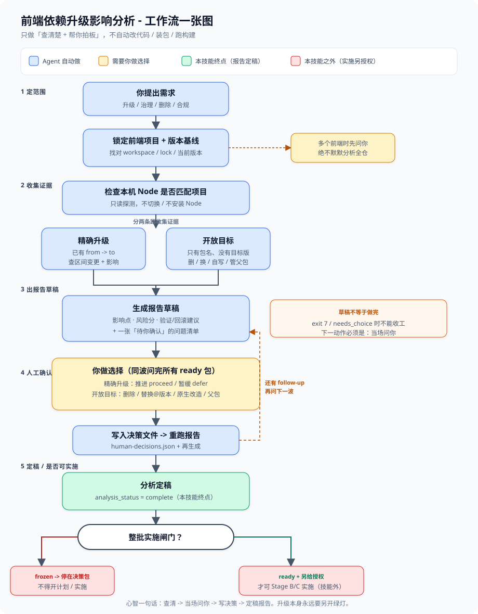
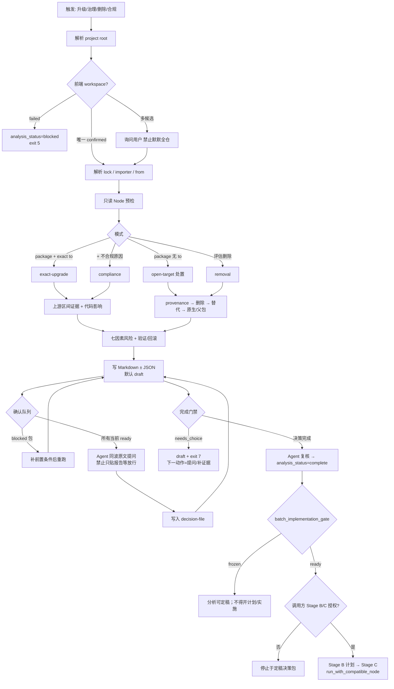
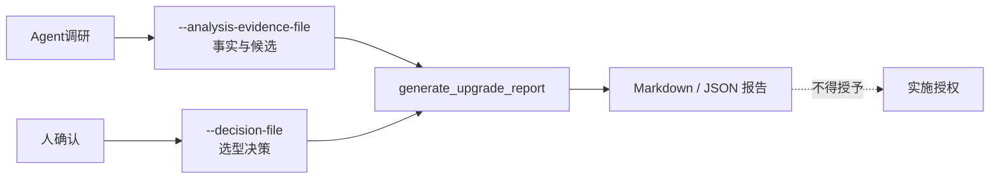

# Frontend Dependency Upgrade Impact Analysis — 使用逻辑总览

> 受众：以 skill 维护/扩展者为主，附操作者附录。  
> 基准：`frontend-dependency-upgrade-impact-analysis/SKILL.md` + `references/*` 的文档意图；脚本仅作 flag / exit code / 模块划分核对。  
> 语言：正文简体中文；术语、枚举、flag、命令、路径保持英文原文。

---

## 0. 小白一张图（工作流）

> 先看图再读细节。蓝 = Agent 自动做；黄 = 要你拍板；绿 = 本技能终点；红 = 实施另授权（技能外）。



**读图顺序（5 步）：**

1. **定范围** — 锁定前端 workspace + lock 基线（多前端时先问你）
2. **收集证据** — 精确升级查 `from→to` 区间；开放目标查删/换/自写/父包
3. **出草稿** — 报告 + 确认队列；草稿 ≠ 做完
4. **当场问你** — 所有 `ready` 包同波确认 → 写决策文件 → 重跑（有 follow-up 再问下一波）
5. **定稿** — `analysis_status=complete` 才是终点；`frozen` 停决策包，`ready` 且另授权才可实施

源文件：[`docs/assets/frontend-dependency-upgrade-workflow.svg`](./assets/frontend-dependency-upgrade-workflow.svg)

---

## 1. 一句话心智模型

这个 skill **只做证据驱动的决策包（Stage A）**，不做实施计划与实施（Stage B/C）。

Agent 解析前端 workspace 与 lock 基线 → 用生成器收集/渲染报告 → **当场**按确认队列完成策略确认（所有当前 `ready` 包同波问完：开放目标选型 / 精确升级 proceed·defer）→ 写入决策文件后重跑 → Agent 复核至 `analysis_status=complete`（本技能终点）→ **仅当 `batch_implementation_gate=ready` 才可交接 Stage B**；实施授权仍由调用方另给。生成器是确定性的采集器 + Markdown 渲染器；启发式结论必须经 Agent 复核后才能宣称权威。

四条永不混淆的状态轴：

| 轴 | 回答的问题 | 典型取值 |
|---|---|---|
| `analysis_status` | 证据是否够完整？ | `partial` / `blocked` / `complete`（**禁止**与 `needs_choice` 同时为 `complete`；本技能终点要求 `complete`） |
| `decision_status` / `selection_status` | 人是否已确认路径/推进？ | `needs_choice` / `not_needed`；`selected` / `needs_explicit_choice` / `not_applicable` |
| `batch_implementation_gate` | 整批是否允许开计划/实施？ | `frozen` / `ready`（任一未确认或非延期包仍 blocked → `frozen`；`frozen` 不阻止分析定稿） |
| 实施授权 | 是否允许改运行时 / 装依赖 / 跑脚本？ | 默认全部否；报告与决策文件**不能**授予 |

**心智纠偏：** 生成器会一次写出证据 + 主轨建议 + 全菜单 + 确认队列；真正「停下来问人」是 Agent 协议。exit **`7`** / `needs_choice` 的**下一动作=照确认队列提问或补证据，不是等待放行**；禁止只贴 draft 报告收工。未写 decision-file、未重跑、未复核升 `complete` 前不得宣称本技能完成。`frozen` 时整批不得开 Stage B/C。细则见 `references/human-confirmation-gates.md`，摘要见 §11.1。

与定框类编排并用时：本 skill **不**引用、也不依赖对方的闸门字段；各自完成后由调用提示词决定下一步。本 skill 必须在确认队列清空并定稿后才结束，避免调用方过早进入「仅放行」类问题。

---

## 2. 边界（永远先读）

**默认允许（只读）**

- 读 manifest、lock、源码、测试、git diff、非变更包元数据
- 只读 Node / 版本管理器探测（如 `node --version`）
- 写报告到调用方已有 change 目录下的证据子目录
- 联网抓取官方 upstream（可关缓存；`--offline` 仅人/调用方显式确认后）
- 公网可达性探测（`registry.npmjs.org` → 必要时 `api.github.com`；不得因 `.npmrc`/内网形态推断 offline）

**默认禁止（需显式授权）**

- 安装 / 升级 / 删除 / 替换依赖
- 跑 migration codemod、改应用代码
- 执行项目 build / test / lint 等脚本
- 安装 Node、全局/会话切换 Node（分析阶段）
- 创建 lifecycle / OpenSpec change 本身
- 把「报告写完」或「人选了轨道」当成实施批准

**行为守恒（默认开启）**

- `behavior_parity_required=yes`
- 删除 / 替换 / 原生改造 / 父包处置都会改依赖构成，因此守恒约束的是**每条路径的可观察行为**，不是偏好某一条路径
- 仅当用户显式允许行为变化 / 删除 / 替换，或传入 `--allow-behavior-change` 时关闭

---

## 3. 目录与模块地图

```text
frontend-dependency-upgrade-impact-analysis/
├── SKILL.md                          # Agent 入口：边界、流程、完成门禁
├── agents/openai.yaml                # 展示名与默认提示
├── references/                       # 文档意图的权威细则（见 §4）
├── scripts/
│   ├── generate_upgrade_report.py    # 主生成器（采集 + 评分 + 渲染 + 队列）
│   ├── run_with_compatible_node.py   # 实施期隔离 Node 执行器（另授权）
│   ├── upgrade_lockfiles.py          # lock 检测/解析、依赖边、engines
│   ├── upgrade_semver.py             # semver / range 求值
│   └── upgrade_alternatives.py       # curated 替代知识表、排序信号、调研标准、改造阶段
├── fixtures/synthetic-frontend/      # 合成前端样例
└── tests/                            # 结构契约与生成器行为测试
```

生成器内部职责分层（逻辑分层，非强制 import 边界）：

| 层 | 职责 | 主要落点 |
|---|---|---|
| CLI / 编排 | 解析参数、解析输出目录、组装 `AnalysisBundle`、exit code | `parse_args` / `build_bundle` / `main` |
| Workspace / baseline | 前端 importer、manifest、lock 直接解析 vs claimed `from` | `resolve_frontend_workspace`、`upgrade_lockfiles` |
| Node runtime | 约束收集、交集、EOL、执行就绪度 | `NodeRuntimeAssessment` 相关逻辑；细则见 `node-runtime-compatibility.md` |
| Upstream | registry / release / changelog / migration；`upstream-evidence/` 包 | HTTP cache + 报告旁证据目录 |
| Code impact | 静态扫描 / 修改候选 / 业务映射占位 | `CodeModificationPoint`、扫描上限参数 |
| Open-target | provenance、删除、替代、原生改造、主轨、确认队列 | `PRIMARY_TRACKS`、`upgrade_alternatives`、confirmation 渲染 |
| Risk | 七因素 + High 覆盖规则 | `risk-model.md` 与 `CHANGE_SCORES` 等常量 |
| Render / validate | 12 章 Markdown、可选 JSON、表宽校验 | `report-contract.md` |
| Decisions（只读） | 读 `human-decisions.json`，重验 confirmed / invalidated | `decision-record-schema.md` |

---

## 4. References 如何挂到流程上

| 文档 | 何时读 | 挂在流程的哪一环 |
|---|---|---|
| `lockfile-and-evidence.md` | 定 scope / baseline / 上游身份 / 公网可达门禁 | 步骤 1–2、5–6；exit `3`/`5`/`8` |
| `node-runtime-compatibility.md` | 任何项目命令 readiness 判断前 | 步骤 3；exit `4`；实施 runner |
| `target-discovery-and-removal.md` | `to` 缺失，或删除/替换在范围 | 模式选择、主轨、确认队列 |
| `impact-analysis-method.md` | 证据优先级、影响链路、停止条件 | 步骤 5–8、完成门禁 |
| `analysis-evidence-schema.md` | Agent 回填复核候选 / 删除覆盖 / Node 提权 | `--analysis-evidence-file` 循环 |
| `decision-record-schema.md` | 人答完确认队列后 | `--decision-file` / 默认 `human-decisions.json` |
| `risk-model.md` | 出风险分与验证深度前 | 步骤 11 |
| `package-categories.md` | 按包族补核查点（只读相关族） | 步骤 7–8 的复核清单 |
| `report-contract.md` | 生成前 / 交付前 | 步骤 12、章节与状态字段 |

---

## 5. 端到端主流程



### 5.1 步骤对照（SKILL Workflow）

1. **Inventory**：依赖字段、overrides/resolutions、包管理器、engines、runtime pins、workspace、lock importer  
2. **Parse lock**：直接版本、观测版本、duplicates、peer context、`catalog:`、baseline 状态  
3. **Node 预检**：本机 Node vs 项目权威约束  
4. **选模式** + 行为守恒姿态  
5. **上游身份**：优先 `versions[version].repository`；校验 `gitHead` / package-aware tag；谱系变化则拆分证据  
6. **官方证据**：release / changelog / migration / peer / engines / security / support / license + URL  
7. **代码映射**：优先知识图谱；否则有界静态搜索；追到页面/路由/流程/测试  
8. **修改候选**：文件、行、用法、上游原因、建议、验证、优先级、可信度  
9. **开放目标特化**：provenance、删除、替代排序、原生改造、父包链、处置菜单；`option_status=missing` 禁止 `complete`  
10. **调研回填**：知识表无条目时，调研清单为必做；经 `--analysis-evidence-file` 回填  
11. **风险**：七因素 → 回归范围 / 发布控制 / 监控 / 回滚触发  
12. **生成并校验报告**；Agent 复核启发式段落  
13. **确认队列**：exit `7` 时当场提问；所有当前 `ready` 同波问完；`blocked` 不问；`switch`/`handle-parent` 后续题下一波  
14. **决策落盘** → 重跑 → Agent 复核至 `analysis_status=complete`（本技能终点）；仅 `batch_implementation_gate=ready` 可交接 Stage B；选型 ≠ 实施批准  

---

## 6. 模式选择

| 输入 | 模式（文档） | 生成器 mode 集合中的对应概念 | 输出重心 |
|---|---|---|---|
| `package` + 精确 `to` | 精确升级 | `exact-upgrade` | `from → to` 区间影响与适配候选 |
| `package`（无 `to`） | 开放目标处置 | `auto-assess` / `target-discovery` / `replacement-discovery` | 删除 / 替换 / 原生改造 / 父包处置；**禁止同库升级** |
| `package` + 不合规原因 | 合规评估 | `compliance-assessment` | 核验理由 + 合规候选 |
| `package` + 评估删除 | 删除评估 | `removal-assessment` | 删除结论、覆盖维度、未知项 |

CLI 入口对应关系：

| Flag | 意图 |
|---|---|
| `--upgrade pkg:from:to` 或 `pkg::to` | 精确升级；省略 `from` 时从权威 lock / before-lock 推断 |
| `--assess pkg` | 开放目标；同库升级永不进入选项 |
| `--removal-candidate pkg` | 删除评估入口 |
| `--reason pkg=...` | 合规/治理原因 |
| `--upgrades-file` | JSON/CSV 批量行（package、可选 from/to、intent、reason） |

开放目标的**建议表达顺序**（呈现时仍一次给全菜单）：

```text
确认基线
  → provenance (direct / both / phantom / transitive / unknown)
  → transitive → 只能 handle-parent 或 override 钉版本
  → phantom → 先消除未声明用法（不接受「补声明了事」）
  → 其余 → 评估删除
  → 删除不成立/不确定/未被选 → 替代库精确版本
  → 无替代 → 原生改造方向
  → 仍无 → isolate / fork / remove-feature
```

主轨 `primary_track`：

| 值 | 何时 |
|---|---|
| `handle-parent` | `transitive` |
| `fix-phantom` | `phantom` |
| `pending-removal-evidence` | 删除 `uncertain` / `not_assessed`（此时不提选型） |
| `remove` | `safe_removal_candidate` |
| `replace` | 有使用点且有可换包@版本 |
| `native-refactor` | 有使用点且无可换包 |
| `proceed-exact` | 已指定精确 `to`（精确升级；确认推进/延期） |

`alternate_tracks` 保持可见；人可 `switch:<track>`。

---

## 7. 状态机与关键枚举（完整）

### 7.1 报告级

| 字段 | 取值 | 含义 |
|---|---|---|
| 报告完成态（首页） | `complete` / `draft` / `blocked` | 生成器默认 `draft`；Agent 复核后才可升 `complete` |
| `analysis_status` | `partial` / `blocked` / `complete` | `blocked` 不得当可实施结论；**禁止**与 `needs_choice` 同时 `complete` |
| `decision_status` | `not_needed` / `needs_choice` | `needs_choice` 时 exit `7`，报告保持 `draft` |
| `behavior_parity_required` | `yes` / `no` | 默认 `yes` |
| `importer_resolution` | `confirmed` / `failed` | `failed` → 整单 blocked，待决策含 `__frontend_workspace__` |
| `option_status`（包级闸门） | `available` / `missing` | `missing` 禁止整单 `complete` |

### 7.2 包级选择

| 字段 | 取值 |
|---|---|
| `selection_status` | `selected` / `needs_explicit_choice` / `not_applicable` |
| `provenance.kind` | `direct` / `both` / `phantom` / `transitive` / `unknown` |
| `primary_track` | `remove` / `replace` / `native-refactor` / `handle-parent` / `fix-phantom` / `pending-removal-evidence` |
| `research_status` | `reviewed` / `curated-only` / `pending` |
| `refactor_plan.status` | `established` / `needs-research` |
| `refactor_plan.scale` | `S` / `M` / `L` |
| `confirmation.status` | `ready` / `blocked` / `decided` |
| `decision.status`（决策文件重验） | `confirmed` / `invalidated` / `unknown-package` |

### 7.3 删除

| `removal.status` | 含义 |
|---|---|
| `safe_removal_candidate` | 七维覆盖齐全且 unknowns 空；仍需人选 |
| `requires_migration` | 发现使用点，不能无适配删除 |
| `not_viable` | 不可接受行为缺口且无已接受方案 |
| `uncertain` | 证据不足（含静态零命中） |
| `not_assessed` | 本轮未评估 |

覆盖维度：`business` / `runtime` / `dynamic` / `build` / `tooling` / `peer` / `transitive`。

### 7.4 Baseline / 上游证据

| `baseline_status` | 含义 |
|---|---|
| `matches_from` / `matches_to` | 与 claimed 对齐 |
| `mismatch` | claimed `from` 与 lock 直接解析冲突 |
| `unknown` | 无法建立直接解析版本 |

| 上游完整性 | 定义 |
|---|---|
| `complete` | 区间完整且九维均 confirmed 或有依据的 not-applicable |
| `partial` | 有官方来源但有缺口；**本地 upstream-evidence 回读最高 partial** |
| `ambiguous` | monorepo tag/release 无法归属 |
| `offline` | 调用方显式 `--offline`；**禁止**凭私有 registry/内网形态推断 |

九维：`registry` / `repository` / `release` / `changelog` / `migration` / `compatibility` / `security` / `support` / `license`。

### 7.5 Node runtime

| `node_runtime_status` | 含义 |
|---|---|
| `compatible-current` | 权威交集存在且本机满足 |
| `runtime-switch-required` | 交集存在、本机不满足、已有兼容 Node |
| `runtime-missing` | 有交集但无兼容 Node |
| `manager-missing` | 需切换但无受支持管理器 |
| `constraint-conflict` | 权威约束无交集 → 分析定框 blocked |
| `unknown` | 无法解析关键范围；**禁止**把本机 Node 当作项目 Node |

约束 `kind`：`runtime-pin` / `project-engine` / `toolchain-engine` / `dependency-engine` / `target-package-engine` / `ci-node-version` / `container-node-image`。  
权威性：`authoritative` 进交集；`observed` 仅证据表（可经 analysis-evidence 提权）。

| `selected_node_support` | 含义 |
|---|---|
| `supported` | 距 EOL > 90 天 |
| `approaching-eol` | 距 EOL < 90 天 |
| `eol` | 已过 EOL |
| `unknown` | 不在已核对计划表 |

### 7.6 替代与处置

| 字段 | 取值 |
|---|---|
| `alternative_candidates[].origin` | `analysis-evidence`（可推推荐）/ `curated-map`（线索，`compliance_status` 恒 `unknown`） |
| `compliance_status` | `eligible` / `ineligible` / `unknown` |
| `constraint_fit` | `fits` / `unknown` / `conflicts` |
| `disposition_options[].availability` | `evidence-available` / `needs-research` / `not-applicable` |

处置菜单固定项：`remove-dependency` / `replace-with-alternative` / `handle-parent-package` / `native-platform-capability` / `in-house-reimplementation` / `isolate-behind-wrapper` / `internal-fork` / `remove-feature`。  
**不含**保留现状、限期豁免、同库升级。

排序信号 `ALTERNATIVE_RANK_SIGNALS`（高→低）：`human-reviewed` → `project-constraint-fit` → `not-deprecated` → `recent-release` → `declared-license`。排序只影响呈现，不改 `recommended_action`。

### 7.7 确认队列选项 ID

`replace:<包>@<版本>` · `remove` · `remove-usage` · `switch-to-declared` · `native-refactor` · `handle-parent` · `pin-override:<包>@<版本>` · `parent-upgrade:<包>@<版本>` · `parent-replace:<包>` · `parent-remove:<包>` · `isolate-behind-wrapper` · `internal-fork` · `remove-feature` · `switch:<轨道>` · `other`  

- 无 `same-package:`  
- `switch:<track>` **不得**写入 decision-file  
- `handle-parent` 两段式：先处置方式，再按父包追问；追问 `package` 形如 `<目标包><-<父包>`

### 7.8 风险

七因子：`version_change` · `dependency_type` · `usage_scope` · `business_criticality` · `lockfile_change` · `test_coverage_gap` · `peer_compatibility`  

| 总分 | 等级 |
|---:|---|
| 0–6 | Low |
| 7–14 | Medium |
| 15+ | High |

覆盖规则可独立把等级抬到 High（auth/支付/baseline mismatch/Node 冲突/peer 冲突等）。

### 7.9 生成器 `ANALYSIS_MODES` 集合

`exact-upgrade` · `auto-assess` · `target-discovery` · `removal-assessment` · `compliance-assessment` · `replacement-discovery`

### 7.10 常见 `recommended_action`（文档意图 + 代码核对）

精确升级侧常见：`upgrade` / `upgrade-to-exact-target` / `adjust-environment-or-target`  

开放目标侧常见：`assess` / `review-removal` / `research-replacement` / `plan-native-refactor` / `plan-migration-before-removal` / `handle-parent-packages` / `fix-phantom-dependency` / `blocked-pending-options` / `remediation-blocked`  

决策确认后：`disposition-selected`  

Workspace 失败：`resolve-frontend-workspace`  

说明：`recommended_action` 是**下一步动作提示**，不是选型结论，更不是实施批准。

---

## 8. 输出路径与产物

解析顺序：

1. `--change-dir`（默认意图）→ `<change-dir>/evidence/frontend-dependency-upgrade/`  
2. `--output-dir` 显式覆盖  
3. 两者皆无 → **报错停止**（不得在项目根自建平行报告目录）
4. 同一轮混有精确升级 + 开放目标 → 在上述目录下自动拆成 `exact/` + `open-target/`，并写 `BATCH-INDEX.md`

可创建：已有 change 目录内的 `evidence/frontend-dependency-upgrade/`  
不可创建：change / lifecycle 本身  

| 产物 | 条件 |
|---|---|
| `frontend-dependency-upgrade-report.md` | 始终 |
| `frontend-dependency-upgrade-report.json` | `--json-output` |
| `upstream-evidence/` | 精确升级默认 download-first（仅 `from→to` 区间）；即使正文 missing 也落盘 `sources.json` + 抓取诊断；**本地回读仅 `--offline`**；`--no-upstream-evidence` 关；`--cleanup-upstream-evidence` 写成功后删 |
| 混批拆分 | 同时有精确升级 + 开放目标 → `exact/` + `open-target/` + `BATCH-INDEX.md` |
| `human-decisions.json` | Agent 写入；生成器只读（默认路径或 `--decision-file`） |

报告 12 章（机器锚点 → 中文标题）：

1. Upgrade Summary → 升级摘要  
2. Release Notes And Changelog Evidence → 发布说明与变更日志证据  
3. Breaking Changes And Migration Notes → 破坏性变更与迁移说明  
4. Dependency Changes → 依赖变化  
5. Diff Evidence Used → 使用的差异证据  
6. Code References → 代码引用  
7. Detailed Code Modification Points → 详细代码修改候选  
8. Business Impact → 业务影响  
9. Technical Risks → 技术风险  
10. Test Scope → 测试范围  
11. Rollout And Rollback → 发布与回滚  
12. Human Confirmation Queue → 人工确认队列  
13. Conclusion → 结论  

（契约写「12 章」时以必需章节表为准；结论章与队列章均属交付必需。）

语言：可见散文默认 `zh-CN`；包名/版本/路径/命令/API/机读枚举保持原文。

---

## 9. CLI 完整参考

### 9.1 `generate_upgrade_report.py`

```bash
python scripts/generate_upgrade_report.py <project-root> [flags...]
```

| Flag | 类型 / 默认 | 作用 |
|---|---|---|
| `project_root` | 位置参数，默认 `.` | 项目根；默认假设当前目录 |
| `--upgrade` | 可重复 | `package:from:to` 或 `package::to` |
| `--assess` | 可重复 | 开放目标包 |
| `--removal-candidate` | 可重复 | 删除评估 |
| `--reason` | 可重复 | `package=reason` 或合规关注点 |
| `--upgrades-file` | path | JSON/CSV 批量 |
| `--analysis-evidence-file` | path | Agent 复核证据 JSON |
| `--decision-file` | path | 人工决策 JSON；缺省读输出目录下 `human-decisions.json`（若存在） |
| `--before-package-json` | path | 升级前 manifest |
| `--after-package-json` | path | 升级后 / 替代 manifest |
| `--before-lock` | path | 权威升级前 lock |
| `--after-lock` | path | 权威升级后 lock |
| `--workspace-importer` | 默认 `.` | lock 内 importer |
| `--allow-baseline-mismatch` | bool | 基线未知/冲突时仍写报告（仅调查草稿；不能过闸） |
| `--business-criticality` | `auto\|low\|medium\|high` | 风险因子覆盖 |
| `--test-coverage` | `auto\|adequate\|partial\|missing` | 风险因子覆盖 |
| `--change-dir` | path | 既有 change/任务目录 |
| `--output-dir` | path | 覆盖输出目录 |
| `--allow-behavior-change` | bool | 关闭默认行为守恒 |
| `--json-output` | 可选 path；裸 flag 写在 Markdown 旁 | 结构化 JSON |
| `--title` | 默认中文标题 | 报告标题 |
| `--offline` | bool | **仅人/调用方显式**；跳过公网探测并允许本地 upstream-evidence 回读。Agent 不得因 `.npmrc`/私有镜像擅自添加 |
| `--no-upstream-evidence` | bool | 关闭报告旁证据包 |
| `--cleanup-upstream-evidence` | bool | 报告成功后删除证据包 |
| `--timeout` | int，默认 `12` | 单次 HTTP 超时（秒） |
| `--network-workers` | int，默认 `6` | 上游并发 |
| `--http-cache-dir` | path | HTTP 缓存目录 |
| `--http-cache-ttl` | int，默认 `21600`（6h） | 缓存 TTL |
| `--no-http-cache` | bool | 禁用 HTTP 缓存 |
| `--max-github-pages` | int，默认 `5` | GitHub API 页上限 |
| `--max-versions` | int，默认 `0`（完整区间） | >0 截断并标记不完整 |
| `--max-note-chars` | int，默认 `1800` | 笔记截断 |
| `--max-code-points` | int，默认 `200` | 代码命中上限 |
| `--max-scan-files` | int，默认 `8000` | 扫描文件上限 |
| `--max-file-bytes` | int，默认 `2000000` | 单文件读取上限 |

### 9.2 `generate_upgrade_report.py` exit codes

| Code | 条件 |
|---:|---|
| `0` | 成功写出；无致命闸门失败，且 `decision_status` 不是 `needs_choice` |
| `2` | 参数/IO/解析等异常（`ValueError` / `OSError` / `JSONDecodeError` / `RuntimeError`） |
| `3` | baseline `mismatch`/`unknown` 且未 `--allow-baseline-mismatch` |
| `4` | `node_runtime.status == constraint-conflict` |
| `5` | `importer_resolution == failed` |
| `6` | 精确升级被兼容性/父依赖/lock 收敛条件 `exact_upgrade_status=blocked` |
| `7` | 报告已写出，但 `decision_status=needs_choice`（开放目标待人工确认队列） |
| `8` | 公网不可达（registry + GitHub 探测均失败，或精确升级区间无 release/changelog 正文且 GitHub 再探失败）；stderr JSON 含 `network_reachability=unreachable` / `awaiting_offline_confirmation`；须人确认后才可 `--offline`。通常**未**写出完整 offline 报告 |

注意：exit ≠ 0 时报告可能已经写出；stderr 说明阻塞原因。exit `0` 也不等于 `analysis_status=complete`。exit `7` 表示草稿可用、选型未完成，不是生成崩溃。exit `8` 表示可达性未证实，不得静默 offline。优先级：`2` → `8` → `5` → `3` → `4` → `6` → `7` → `0`。

### 9.3 `run_with_compatible_node.py`

```bash
python scripts/run_with_compatible_node.py <project-root> \
  --node-version <exact-semver> \
  --command "<cmd>" [--command "<cmd>" ...] \
  [flags...]
```

| Flag | 类型 / 默认 | 作用 |
|---|---|---|
| `project_root` | 必需 | 项目根 |
| `--node-version` | 必需，精确 semver | 报告选定的已安装 Node |
| `--manager` | `auto\|nvm-windows\|nvm\|fnm\|volta\|asdf`，默认 `auto` | 版本管理器 |
| `--command` | 可重复，至少一条 | 要执行的命令 |
| `--execute` | bool | 缺省 dry-run 只打印计划 |
| `--approve-runtime-switch` | bool | 执行模式必需 |
| `--approve-dependency-install` | bool | install/upgrade 类命令必需 |
| `--approve-project-scripts` | bool | build/test 等脚本必需 |
| `--allow-lockfile-format-migration` | bool | 仅当报告显式批准 lock 格式迁移时传入 |
| `--command-timeout` | int，默认 `1800`；`0`=无限 | 单命令超时 |
| `--log-json` | path | dry-run 与 execute 均可写日志 |

执行策略：优先隔离子进程 PATH → 管理器单命令隔离 → 最后才 nvm-windows 全局切换 + `finally` 恢复。  
**永不**自动 `node-install`；含 Node 安装意图的 command 直接拒绝。  
实施期禁止在 runner 外用本机 Node 跑项目命令。npm 变更类命令执行前校验：隔离环境的 npm 主版本必须与现有 `lockfileVersion` 兼容（v1→npm≤6，v2→7–8，v3+→≥9）。默认冻结 lock 格式字段；内容（依赖树）可变，格式不可悄然变化。

| Exit | 条件 |
|---:|---|
| `0` | dry-run 成功，或全部命令成功且恢复/约束/lock 格式完整性通过 |
| 命令自身非 0 | 透传该 exit（或规范化为非 0） |
| `2` | 参数/运行时错误（含缺少批准、npm↔lock 不兼容） |
| `5` | 恢复未 verified |
| `6` | Node 约束文件/字段被改动（`constraint_integrity != verified-unchanged`） |
| `7` | lock 格式字段被改动且未批准迁移（`lock_format_integrity=changed`） |
| `124` | 单命令超时（写入该命令的 result；GNU timeout 惯例） |

---

## 10. 两份 JSON 输入的边界



| | analysis-evidence | decision-file |
|---|---|---|
| 谁写 | Agent 调研后 | Agent 在人确认后 |
| 内容 | 候选、删除覆盖、官方来源、Node 附加约束 | track / choice / selected_package@version |
| 能否批准实施 | 否 | 否 |
| 同库 `target_candidates` | **已废弃**；写入忽略并警告 | 同库升级选择会 invalidated |

`analysis-evidence` 提权 Node：`node_runtime.additional_project_constraints` + 可选精确 `selected_project_node`。

---

## 11. 人工确认循环（Agent 协议）

1. 生成报告，读「人工确认队列」、确认阶段与 `batch_implementation_gate`；`needs_choice` 时 exit `7`  
2. **禁止**只贴 draft / 横幅后等待用户「继续/放行」；下一动作必须是提问或补证据  
3. `blocked`：先补证据 / 解精确升级阻塞，再重跑（勿问选型/推进）  
4. 所有当前 `ready`：**同一波**原文提问（开放目标选项表 + 精确升级 `proceed:包@版本` / `defer` / `other`）  
5. 若答 `switch:<track>` → **下一波**改问同节「改轨问题」整表，**不**写 decision-file  
6. `handle-parent` 勿落盘；**下一波**继续写 `包<-父包` 追问  
7. 最终答案写入 `human-decisions.json` → 重跑 → `disposition-selected` / `proceed-selected` / `deferred`  
8. Agent 复核上游与映射，将 `analysis_status` 升为 `complete`（本技能终点）  
9. 仅当 `batch_implementation_gate=ready` 时交接 Stage B；Stage C 另需实施授权 + runner approve flags  

决策落盘 + `complete` **只表示本技能分析终点**；不是计划批准，更不是实施批准。同批任一包未确认或非延期包仍 blocked → 整批 `frozen`（可不阻止分析定稿）。

### 11.1 人确认点地图（摘要）

| 闸门 | 精确升级 | 开放目标（无 `to`） |
|---|---|---|
| 多 frontend workspace | 问 | 问 |
| 基线 `from` 冲突 | 问 / blocked | 问 / blocked |
| 处置选型（删/换/原生/父包） | **不问** | **必须问**（G4）；与其他 ready 同波；exit `7` |
| 推进确认 proceed/defer | **必须问**（G7）；与其他 ready 同波；exit `7` | 不适用 |
| 证据/技术阻塞（队列 blocked） | 先解阻塞 | 先补证据 |
| `batch_implementation_gate` | 未完成或 blocked → `frozen` | 同左 |
| 实施装依赖/改代码 | 技能外（Stage C） | 技能外 |

完整表：`frontend-dependency-upgrade-impact-analysis/references/human-confirmation-gates.md`。

---

## 12. 完成门禁（交付前核对）

文档要求在标 complete 前确认：

- [ ] **`decision_status` 不是 `needs_choice`**（开放目标选型 + 精确升级 proceed/defer 已落盘并重跑）  
- [ ] **Agent 已复核并将 `analysis_status` 升为 `complete`**（不得把 exit `7` draft 当完成）  
- [ ] **`batch_implementation_gate=ready`** 才交接 Stage B；`frozen` 不得开计划/实施（可不阻止分析定稿）  
- [ ] **未**将 `analysis_status=complete` 与 `needs_choice` 并存  
- [ ] baseline / lock 类型 / workspace / importer 已确认（`importer_resolution=confirmed`）  
- [ ] 本机 Node、项目约束、管理器、所选项目 Node、execution readiness、恢复计划明确  
- [ ] `constraint-conflict` / 缺失管理器或 Node / `unknown` Node 未伪造成可实施  
- [ ] 精确升级覆盖完整版本区间；开放目标遵守决策顺序与选项完整性  
- [ ] eligible 候选有 criteria + evidence URLs；`research_status=reviewed` 或调研缺口可见  
- [ ] 删除证据覆盖要求维度或显式 uncertain  
- [ ] 高置信修改点同时有应用证据与上游依据  
- [ ] 七因素可复算；High 覆盖规则已检查  
- [ ] 关键流程含正向 / 失败 / 恢复验证；发布与回滚有触发条件  
- [ ] Markdown 章节与表宽通过契约；启发式段落已人工复核；可见散文为中文  

---

## 13. 操作者附录：怎么跑一轮

### 精确升级

```bash
python frontend-dependency-upgrade-impact-analysis/scripts/generate_upgrade_report.py . \
  --upgrade axios::1.7.9 \
  --change-dir openspec/changes/<id>
```

Agent：复核上游与代码映射 → 需要时补 analysis-evidence → **仍须确认 proceed/defer**（可与其他精确升级批量问）→ 写入 decision-file → 重跑 → 确认 `batch_implementation_gate=ready`。  
**实施不在本技能内**；仅当调用方完成 Stage B 并另开 Stage C 授权后，才使用 `run_with_compatible_node.py`（dry-run → 再加 approve flags）。

### 开放目标治理

```bash
python .../generate_upgrade_report.py . \
  --assess deprecated-client \
  --reason "deprecated-client=不符合维护状态要求" \
  --change-dir openspec/changes/<id> \
  --json-output
```

若出现「替代方案调研任务」：按 `RESEARCH_CRITERIA` 调研 → 写 `--analysis-evidence-file` → 重跑 → 走确认队列 → 写 decision-file → 再重跑。

### 常见阻塞怎么处理

| 现象 | 处理 |
|---|---|
| exit `5` / `__frontend_workspace__` | 指定 importer 或消歧前端包 |
| exit `3` / baseline mismatch | 纠正 `from`、提供 `--before-lock`，或仅调查时 `--allow-baseline-mismatch` |
| exit `4` / constraint-conflict | 解决互相矛盾的 pin/engines；勿用本机 Node 硬扛 |
| `unknown`（无权威约束） | 分析可继续；**项目命令硬阻断**，直至证据指定精确 `selected_project_node` 或补齐 pin/engines |
| `runtime-switch-required` | 分析可继续；实施前批准 switch，优先隔离执行；禁止本机 Node 跑项目命令 |
| `research_status` 非 reviewed | 必须回填 analysis-evidence |
| `option_status=missing` | 补替代 / 调用点 / 父包链 / 删除证据之一 |
| exit `7` / `needs_choice` | **立刻**按确认队列提问（勿等放行）→ 写 `human-decisions.json` → 重跑 → 复核至 `complete` |
| exit `8` / `awaiting_offline_confirmation` | 先用 curl 复核公网；确认不通后由人显式 `--offline`；禁止因 `.npmrc`/内网形态推断 |
| 多前端 workspace | **问用户**；禁止默默分析整仓 |

---

## 14. 与外部编排的关系

本 skill **不绑定**任何交付/OpenSpec 生命周期状态机。调用方若有 change 目录，只把报告挂到其 `evidence/frontend-dependency-upgrade/`。  
审批台账、任务状态、实施 PR 均由调用方拥有；本 skill 只导出中性字段（见 `target-discovery-and-removal.md` §6）。

---

## 15. 维护者速查：改代码时先改哪

| 想改的行为 | 先改文档意图 | 再对脚本 |
|---|---|---|
| 报告章节/字段 | `report-contract.md` | 渲染与校验 |
| 开放目标轨道/队列 | `target-discovery-and-removal.md` | confirmation / provenance |
| 人确认门禁 / exit 7 | `human-confirmation-gates.md` | 首页横幅、结论闸门、`main` exit |
| 替代知识表 | （文档描述收录标准） | `upgrade_alternatives.py` + `REPLACEMENT_MAP_REVIEWED` |
| Lock / 上游包 / 公网可达门禁 | `lockfile-and-evidence.md` | `upgrade_lockfiles.py` + upstream / `probe_http_reachable` / exit `8` |
| Node 闸门 | `node-runtime-compatibility.md` | runtime assessment + runner |
| 风险阈值 | `risk-model.md` | `CHANGE_SCORES` / `RISK_*` 常量 |
| 证据/决策 JSON | 对应 schema md | 加载与重验逻辑 |
| Agent 主流程文案 | `SKILL.md` | 仅当行为与文案冲突时改脚本 |

结构契约测试见 `tests/test_skill_structure.py`：references 中的关键常量名应与生成器导出保持一致。

---

## 16. 示例命令速查（SKILL 原文形态）

```bash
# 精确升级；from 从权威当前 lock 推断
python scripts/generate_upgrade_report.py . \
  --upgrade axios::1.7.9 \
  --change-dir openspec/changes/<id>

# 开放目标 + 复核证据 + JSON
python scripts/generate_upgrade_report.py . \
  --assess deprecated-client \
  --reason "deprecated-client=不符合维护状态要求" \
  --analysis-evidence-file dependency-analysis-evidence.json \
  --change-dir openspec/changes/<id> \
  --json-output

# 显式关闭行为守恒
python scripts/generate_upgrade_report.py . \
  --assess legacy-client \
  --allow-behavior-change \
  --change-dir openspec/changes/<id>

# 离线草稿（须人确认公网不通后显式传入；可回读 upstream-evidence）
# 事前：curl -I --max-time 12 https://registry.npmjs.org/ ；失败再 curl api.github.com
python scripts/generate_upgrade_report.py . \
  --upgrade vite:4.5.0:5.2.0 \
  --change-dir openspec/changes/<id> \
  --offline
```

---

*文档版本说明：对应当前仓库内 skill 文档意图；若 `SKILL.md` / references 与本文件冲突，以 skill 目录内文档为准，并应回修本文件。*
