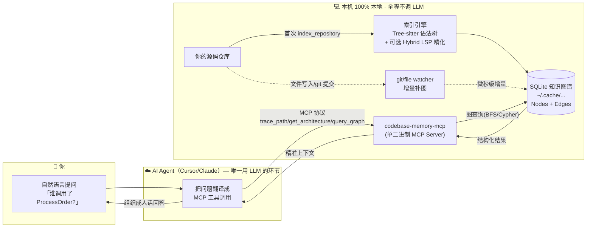

<!--
==========================================================================
黄金范例(GOLD-STANDARD EXAMPLE) · 仅供学习房屋风格,不要原样照抄内容
--------------------------------------------------------------------------
这是一篇已成稿的真实文章,作为本 Skill 的「房屋风格」基准。
写新文章时:
  - 学它的「节序、案例五件套、callout 用法、语气、中文化、校验脚注」。
  - 不要照抄它的具体仓库内容(工具名、命令、数字都是 codebase-memory-mcp 专属)。
  - 你的文章要基于目标仓库的真实官方资料重新填写。
本范例自包含,分享给他人/其他 Agent 时无需任何外部文件即可参考。
==========================================================================
-->

# Codebase Memory MCP 使用示例：单二进制本地知识图谱让代理结构查询省 99% Token

> 以「在 Cursor 里接手一个多语言 monorepo：先 10 秒看清架构与路由，再查 `ProcessOrder` 调用链、用 Cypher 筛死代码，合入前看未提交 diff 的 blast radius」为案例，说明 [DeusData/codebase-memory-mcp](https://github.com/DeusData/codebase-memory-mcp) 的核心价值：**Tree-sitter + Hybrid LSP 预索引 → 持久 SQLite 知识图谱 → 14 个 MCP 工具**，让编码代理用 `trace_path` / `get_architecture` / `query_graph` 等直接答结构题，而不是反复 grep/Read——**100% 本地，索引阶段不调用 LLM**。


## 新手专区：从 0 到 1 手把手

> 这一节假设你**几乎什么都不懂**：可能你刚学会写一点代码，第一次听说「AI 代理」。读完并照做，你就能让 AI 真正「看懂」你的整个项目。全程约 20–30 分钟，**不用花钱、不用配 API Key**。

### 第 0 步：先搞懂 5 个名词（用大白话）

别被术语吓到，本质都很朴素：

| 术语 | 一句话大白话 | 生活类比 |
|---|---|---|
| **Cursor** | 一个内置 AI 助手的代码编辑器（写代码的软件） | 带了「智能副驾」的记事本 |
| **AI 代理 / Agent** | Cursor 里那个能帮你读代码、改代码的 AI | 一个会帮你干活的实习生 |
| **MCP** | 一个「插件协议」，给 AI 装上新本领的标准插座 | 手机的 USB 接口，插上就能扩展功能 |
| **本仓库（codebase-memory-mcp）** | 一个 MCP 插件，先把你项目「读一遍」存成地图，AI 之后查地图就行 | 给实习生先发一本「项目说明书 + 地图」 |
| **索引（index）** | 让插件把你的项目扫描一遍、建好那张地图的动作 | 图书馆把所有书登记进检索系统 |

**为什么要装它？**（解决什么痛点）

没有它时，AI 想知道「`ProcessOrder` 这个函数被谁调用了」，只能像翻书一样一页页 `grep`/打开文件去找——**又慢、又费钱**（每次翻看都消耗 Token，也就是花在 AI 上的「字数额度」）。
装上它之后，AI 先看一遍建好地图，以后直接「查地图」秒回——官方测试称答得更准、**省约 10 倍 Token**。

> [!note] 一句话总结
> **它是给 AI 的「项目记忆」**：让 AI 不必每次都重读你的代码，而是查一张提前画好的地图。

### 第 1 步：确认你具备的前置条件

照单检查，缺哪个补哪个：

- [ ] 一台电脑（本指南以 **Windows 11** 为主，Mac/Linux 在下面也给了命令）。
- [ ] 已安装 **Cursor**（没装就去 [cursor.com](https://cursor.com) 下载安装，免费版即可）。
- [ ] 有**一个真实的代码项目**（哪怕是你课程作业的文件夹也行，里面有 `.py` / `.js` / `.go` 等代码文件）。
- [ ] 能上网访问 GitHub。

> 不需要：Node.js、Docker、任何 API Key、任何付费。它是**单个可执行文件**，零额外依赖。

### 第 2 步：安装插件（复制粘贴即可）

1. 在 Windows 按 `Win` 键，搜索 **PowerShell**，点开它（黑色或蓝色命令窗口）。
2. 把下面**两行**逐行粘贴进去、各按一次回车：

```powershell
Invoke-WebRequest -Uri https://raw.githubusercontent.com/DeusData/codebase-memory-mcp/main/install.ps1 -OutFile install.ps1
.\install.ps1
```

- 第一行：把官方安装脚本下载到当前文件夹。
- 第二行：运行它。脚本会自动下载程序、并帮你把插件「插」进 Cursor。

> [!warning] 可能遇到的拦截（正常现象，别慌）
> Windows 可能弹出蓝色 **SmartScreen** 警告（因为这个 exe 没买微软签名）。点「**更多信息**」→「**仍要运行**」即可。
> 想更安心：可对照官方 release 页的 `checksums.txt` 校验文件，但新手可先跳过。

Mac / Linux 用户改用这一行（在「终端」里粘贴）：

```bash
curl -fsSL https://raw.githubusercontent.com/DeusData/codebase-memory-mcp/main/install.sh | bash
```

### 第 3 步：完全重启 Cursor（最容易被忽略的一步）

**必须彻底退出再打开**，否则 Cursor 看不到新插件：

1. 关闭所有 Cursor 窗口。
2. 重新打开 Cursor。
3. 进入 `Settings`（设置）→ 找到 `MCP` 一栏。
4. ✅ **成功标志**：列表里出现 `codebase-memory-mcp`，并显示 **14 tools（14 个工具）**。

> 如果没看到：90% 是「没有彻底重启」或「装完没重启」。再退一次、重开一次。

### 第 4 步：让 AI 给你的项目建地图（索引）

1. 在 Cursor 里用「打开文件夹」打开你那个**真实项目**。
2. 打开 AI 对话框（聊天侧栏），直接用中文/英文说：

```text
Index this project（请索引这个项目）
（或通用中文：请用 Codebase Memory MCP 索引本项目，路径用本项目的绝对路径）
（或更明确：请用 index_repository，repo_path 用本项目的绝对路径）
```

3. AI 会自动调用 `index_repository` 开始扫描。**中小项目几秒到几十秒**就好。

> [!tip] 如果它报错说找不到路径
> 告诉它：「请用 Codebase Memory MCP 索引本项目，路径用本项目的**绝对路径**」；或更明确：「请用 index_repository，repo_path 用本项目的**绝对路径**」。
> 绝对路径就是完整路径，例如 `D:/Hzhao/myproject`，而不是 `./myproject`。

### 第 5 步：问出你的第一个「架构题」（见证奇迹）

索引完成后，在对话框里粘贴这句：

```text
用 get_architecture 告诉我这个项目用了哪些编程语言、有哪些主要模块/包、入口在哪、有哪些 REST 路由。先别 grep 全仓。
```

AI 会**秒回**一份结构化总结（语言分布、包结构、入口、路由）。
这就是「查地图 vs 翻书」的差别——以前 AI 要翻好几轮文件，现在一步到位。

再试一个「调用链」问题（把 `ProcessOrder` 换成你项目里真实的函数名）：

```text
用 trace_path 查 ProcessOrder 这个函数被谁调用了，depth=3。
```

### 第 6 步：确认你真的成功了 ✅

满足以下任意一条，就说明你已经从 0 跑到 1 了：

- Cursor 的 MCP 设置里能看到 `codebase-memory-mcp（14 tools）`。
- 你说「Index this project」后，AI 真的调用了 `index_repository` 并完成。
- 你问架构题时，AI 用了 `get_architecture` 而不是疯狂打开文件。

### 新手最容易卡住的 4 件事

| 现象 | 真正原因 | 解决 |
|---|---|---|
| MCP 设置里看不到插件 | 装完没有**彻底重启** Cursor | 全部关掉，重开 |
| AI 说 index 失败 | 给的是相对路径 | 让它用**绝对路径**（如 `D:/code/proj`） |
| `trace_path` 返回 0 条 | 函数名写错/大小写不符 | 先让 AI 用 `search_graph` 搜出准确名字 |
| 弹安全警告 | exe 未签名 | 「更多信息 → 仍要运行」 |

### 接下来去哪？

跑通以上 6 步后，你已经会用最核心的功能了。想深入，按需阅读下面的**进阶参考**：

- 想知道全部 14 个工具都能干嘛 → [MCP 工具清单（14）](#mcp-工具清单14)
- 想用更高级的图查询找「死代码」 → [案例 E · Cypher](#五案例-e--cypherquery_graph-查死代码)
- 想合并代码前看「影响范围」 → [案例 F · detect_changes](#六案例-f--合入前detect_changes)
- 想用 3D 图肉眼浏览项目 → [案例 G · 3D 图谱 UI](#七案例-g--3d-图谱-ui可选)

> 下面的内容偏「参考手册」，名词较多，是给你跑通后回查用的，**不必一次读完**。

---

## 仓库能力入口一览

> 本仓库以 **单静态二进制 + MCP Server + 可选 CLI** 为主；`install` 还会为 Claude Code 等写入 **Skills 与 PreToolUse Hooks**（增强 Grep/Glob，非阻塞）。**实操见正文**。

### 二进制、MCP 与 CLI 是什么关系？

**常见误解**：要分别装「索引器」「MCP 包」「可视化」三套东西。

**实际情况**：`codebase-memory-mcp` 是**一个可执行文件**。MCP 模式、CLI 子命令、可选 3D UI（`--ui` 变体）都来自同一安装物；图谱存在 `~/.cache/codebase-memory-mcp/`（可用 `CBM_CACHE_DIR` 覆盖）。

| 入口 | 谁在用 | 典型操作 |
|---|---|---|
| **MCP（Agent）** | Cursor / Claude Code 等 | `index_repository`、`trace_path`、`get_architecture`、`query_graph` |
| **CLI（你）** | 终端 | `codebase-memory-mcp cli trace_path '{"function_name":"main"}'` |
| **3D UI（可选）** | 浏览器 | `codebase-memory-mcp --ui=true --port=9749` → `http://localhost:9749` |
| **install 脚本** | 首次 | 写 MCP 配置 + Skills + Hooks，并下载/放置二进制 |

**推荐首日链**（Windows + Cursor）：

```text
1) 下载并运行 install.ps1（全局一次）
2) 完全重启 Cursor
3) 打开目标项目，对 Agent 说「Index this project」
4) 验收：Settings → MCP 可见 codebase-memory-mcp（14 tools）；list_projects 有节点统计
```

**与 CodeGraph 的关系**：二者都是「物理雷达」类 MCP，**不要同时接两个**——工具名不同但代理会困惑、Claude 上还可能双开 Grep 增强 Hook。切换前对旧工具执行 `codegraph uninstall` 或 `codebase-memory-mcp uninstall`。详见正文 **§ 八**。

### 索引维度

| 维度 | 说明 |
|---|---|
| **名称** | MCP 工具名 / CLI `cli <tool>` / `install` / `config` |
| **类型** | 单二进制 · MCP Server · CLI · 可选 HTTP 3D UI |
| **职能** | 理解 · 检索 · 影响分析 · 架构 · ADR · 安全边界 |
| **触发** | Agent 调 MCP · 自然语言「Index this project」· `auto_index` 首次连接 |
| **首日** | ✅ `install.ps1` + 重启 Agent + `index_repository` |

### MCP 工具清单（14）

> [!tip] 别背！14 个工具其实是「一类事」——代码理解（物理雷达）
> 它们全都服务于同一个目的：**让 Agent 查本地图谱、答结构题**。你**不需要记住工具名**，更不用手敲——**用大白话说出意图，Agent 会自己挑工具**。心智压缩成 5 句话即可：
>
> | 你想干什么（说人话） | Agent 会自动调 | 记忆口诀 |
> |---|---|---|
> | 「**建索引** / Index this project」 | `index_repository` | 第一步：建地图 |
> | 「这项目**架构**/语言/路由长啥样」 | `get_architecture` | 看全局 |
> | 「**谁调用了** X / X 调了谁」（看**依赖**） | `trace_path` | 查依赖/调用链 |
> | 「帮我**找** XXX 函数/概念」 | `search_graph` / `semantic_query` | 找东西 |
> | 「我**改的代码**影响了啥」 | `detect_changes` | 看影响面 |
>
> 其余 9 个（`query_graph` 死代码、`manage_adr`、`get_code_snippet`、`list_projects`、`index_status`…）是进阶/管理工具，**用到时再查本表**。一句话：**「构建索引、查看架构、查看依赖」这类问题统统交给 codebase-memory-mcp，你只管用中文提问。**

| 工具 | 职能 | 首日 | 说明 |
|---|---|:---:|---|
| `index_repository` | 理解 | ✅ | 索引仓库；之后 background watcher 增量更新 |
| `list_projects` | 工具 | ✅ | 已索引项目与节点/边计数 |
| `index_status` | 工具 | — | 某项目索引进度 |
| `delete_project` | 工具 | — | 删除项目图谱数据 |
| `get_graph_schema` | 理解 | ✅ | **先跑**：节点/边类型与属性定义 |
| `search_graph` | 检索 | ✅ | 按 label、名称 regex、文件模式、度过滤 |
| `search_code` | 检索 | — | 仅在已索引文件内 grep 式搜索 |
| `semantic_query` | 检索 | — | 本地嵌入向量 + 多信号打分语义搜索 |
| `trace_path` | 理解 | ✅ | BFS：谁调用/被谁调用（depth 1–5） |
| `query_graph` | 理解 | — | openCypher **只读**子集 |
| `get_architecture` | 理解 | ✅ | 语言、包、入口、路由、热点、集群、ADR 一览 |
| `detect_changes` | 理解 | — | git diff → 受影响符号 + 风险分类 |
| `get_code_snippet` | 理解 | — | 按 qualified name 读源码 |
| `manage_adr` | 文档 | — | 架构决策记录 CRUD |
| `ingest_traces` | 理解 | — | 运行时 trace 校验 HTTP 边（进阶） |

### CLI 主命令（节选）

| 命令 | 职能 | 首日 | 说明 |
|---|---|:---:|---|
| `codebase-memory-mcp install` | 工具 | ✅ | 检测 Agent 并写 MCP/Skills/Hooks |
| `codebase-memory-mcp uninstall` | 工具 | — | 清 Agent 配置，**不删**二进制与 DB |
| `codebase-memory-mcp update` | 工具 | — | 检查并更新二进制 |
| `codebase-memory-mcp config set auto_index true` | 工具 | — | 新会话首次连接自动索引 |
| `codebase-memory-mcp cli <tool> '{json}'` | 理解 | — | 任意 MCP 工具 CLI 调用 |
| `codebase-memory-mcp --ui=true` | 工具 | — | 需 **ui** 变体安装包 |

**支持宿主（install 自动检测）**：Claude Code · Cursor · Codex CLI · Gemini CLI · Zed · OpenCode · Antigravity · Aider · KiloCode · VS Code · OpenClaw · Kiro。

---

## 0. 案例背景

你在 Cursor 里维护一个约 **1200 文件** 的后端 monorepo：Go 网关 + Python 业务服务 + 部分 TypeScript 管理脚本。今天要：

1. **10 秒内**知道语言分布、包结构、REST 路由入口——以前 Agent 会多轮 `Glob` + `Read`。
2. 改 `ProcessOrder` 前查清 **inbound 调用链**。
3. 重构前用 **Cypher** 找零 caller 的函数候选。
4. 合入前看 **未提交 diff** 波及的符号与风险。

[codebase-memory-mcp](https://github.com/DeusData/codebase-memory-mcp) 的定位是：**先建本地知识图谱，再让 MCP 客户端 Agent 当「查询翻译器」**——服务端**不含 LLM**，避免再配一套 NL→图查询模型。官方论文（[arXiv:2603.27277](https://arxiv.org/abs/2603.27277)）在 31 个真实仓库上报告约 **83%** 答案质量、**10×** 更少 token、**2.1×** 更少 tool calls（相对逐文件探索）。

本文在 **Windows 11 + Cursor** 环境示范；Claude Code / Codex 等价路径见案例 A 备选。

## 0.1 这个仓库到底是什么？

| 层 | 内容 |
|---|---|
| **安装层** | `install.ps1`（或 curl 一行脚本）；单静态二进制，**无 Node/Docker/API Key** |
| **接 Agent** | `install` 写 `.cursor/mcp.json` 等；Claude Code 额外装 4 Skills + PreToolUse（Grep/Glob 命中符号时注入 `search_graph` 上下文） |
| **符号解析** | **开箱即用**：内置 Tree-sitter 做语法树解析，不需你预装任何语言 LSP；若本机**恰好**装了 `gopls`/`pyright` 等标准 LSP，会自动以 **Hybrid 模式**聚合更精准的类型/跨文件边，**无需手动配环境变量**（详见下方说明） |
| **索引** | `index_repository(repo_path=绝对路径)`；数据在 `~/.cache/codebase-memory-mcp/`；可选 commit `.codebase-memory/graph.db.zst` |
| **运行时** | git/file watcher 增量；`config set auto_index true` 可首次连接自动索引 |

### 架构原理图：数据怎么流、LLM 在哪条边之外

> 一图看懂「100% 本地、索引不调 LLM」的边界：**唯一可能联网/用 LLM 的，是你自己那个 Cursor/Claude Agent**（把自然语言翻成工具调用）；建图与查图全程在你电脑里。



> [!note] LSP 依赖说明（开发者最关心的成本问题）
> - **要不要自己装 gopls/pyright？** 不用。没有任何 LSP，工具靠 **Tree-sitter** 也能跑出完整调用图，开箱即用。
> - **装了 LSP 会怎样？** 工具自动走 **Hybrid 模式**，把 LSP 的类型推导/跨文件解析「叠加」上去，让跨语言跳转、接口实现等边**更准**——这是锦上添花，不是前置条件。
> - **配置成本** ≈ 0：不需要你设环境变量或写配置；工具自行探测本机已有的语言服务。

### 与 CodeGraph、Understand Anything 的边界

| 维度 | codebase-memory-mcp | CodeGraph | Understand Anything |
|---|---|---|---|
| 索引是否用 LLM | **否** | **否** | **是** |
| 语言 | **158** + Hybrid LSP | 20+ | Tree-sitter + LLM 摘要 |
| MCP 工具 | **14**（Cypher/ADR/语义/架构） | **8**（explore/impact/**affected**） | 斜杠 `/understand*` 为主 |
| 索引落点 | 中央 cache + 可选仓内 artifact | 每仓 `.codegraph/` | `.understand-anything/` |
| 与人冲突 | 与 **CG：MCP 二选一** | 与 **CBM：MCP 二选一** | 与二者 **可叠加** |

完整三栏对照见索引 `[[00 AI GitHub精选仓库收藏]]` 之 [代码理解三件套](00%20AI%20GitHub精选仓库收藏.md#代码理解三件套物理雷达--物理雷达-pro--理解大脑)。

## 0.2 要不要一上来全量使用？

**建议首日链**：`install.ps1` → 重启 Cursor → 一个真实项目 **Index** → 问一道架构题 → `list_projects` 验收。

**适合**：

- 代理探索阶段 tool calls / token 偏高。
- **多语言 monorepo** 或需要 **Cypher / ADR / 死代码 / 3D 图谱**。
- 涉密仓：**索引不出本机、不调 LLM**。
- Windows 想要 **单 exe、零运行时依赖**。

**不适合**：

- 要 **LLM 业务语义、Guided Tour、业务域 flows** → 用 Understand-Anything。
- 已深度绑定 **CodeGraph `affected` CI** 且不需要 CBM 高级特性 → 可继续用 CG。
- **已与 CodeGraph 同时接 MCP** → 先 uninstall 其一。

## 0.3 功能覆盖索引

| 功能 / 能力 | 本文位置 | 第一天需要吗 | 主要风险 |
|---|---|---:|---|
| Windows `install.ps1` | 案例 A | 是 | SmartScreen 警告；用 checksums 校验 |
| 重启 Cursor + MCP 14 工具 | 案例 A | 是 | 未重启则 MCP 不可见 |
| `index_repository` / 「Index this project」 | 案例 B | 是 | 须传**绝对路径** |
| `get_architecture` | 案例 C | 是 | 大仓首次索引 CPU 占用 |
| `trace_path` | 案例 D | 是 | 符号名需先 `search_graph` 消歧 |
| `query_graph` Cypher | 案例 E | 建议 | 只支持只读 openCypher 子集 |
| `detect_changes` | 案例 F | 可选 | 仅未提交/已索引符号 |
| 3D UI | 案例 G | 可选 | 需 `--ui` 变体 |
| A/B 看效果实验 | § 七·五 | 建议 | 对比工具调用次数与完整度 |
| 与 CG/UA 选型 | § 八 | 建议 | **勿双开 CG+CBM MCP** |

---

## 一、案例 A · Windows 安装并接到 Cursor

> **场景**：你想把这个「项目记忆」插件装进 Cursor，让 AI 之后能查图谱。一次性配置，全局生效。

**角色**：Windows 11，已装 Cursor，可访问 GitHub raw。

**实操卡**

```text
前置条件: 允许运行 install.ps1（会写 Cursor MCP 配置）；愿意审阅脚本内容。
可执行步骤:
  1) PowerShell:
     Invoke-WebRequest -Uri https://raw.githubusercontent.com/DeusData/codebase-memory-mcp/main/install.ps1 -OutFile install.ps1
  2) （推荐）notepad install.ps1 快速浏览
  3) .\install.ps1
     可选 3D UI: .\install.ps1 --ui
     仅二进制不写配置: .\install.ps1 --skip-config
  4) 完全退出并重启 Cursor
  5) Cursor Settings → MCP，确认 codebase-memory-mcp 及 14 tools
验收方式:
  - 终端: codebase-memory-mcp --version 或 which/where 能找到二进制
  - Cursor MCP 列表可见该 server
失败处理:
  - SmartScreen → 「更多信息」→「仍要运行」；对照 release checksums.txt 校验 SHA-256
  - MCP 未出现 → 查 .cursor/mcp.json 路径是否为绝对路径；重跑 install
  - 二进制不在 PATH → 按 install 输出把 ~/.local/bin 等加入用户 PATH
风险边界: install 会改 Agent MCP/Skills/Hooks；回滚用 codebase-memory-mcp uninstall。中风险，可逆。
```

**macOS / Linux 一行装**：

```bash
curl -fsSL https://raw.githubusercontent.com/DeusData/codebase-memory-mcp/main/install.sh | bash
# 带 UI:
curl -fsSL .../install.sh | bash -s -- --ui
```

**Claude Code 备选**：对 Agent 说「Install this MCP server: https://github.com/DeusData/codebase-memory-mcp」，或手动在 `~/.claude/.mcp.json` 写入绝对路径 command。

**手动 MCP 配置**（不用 install 时）：

```json
{
  "mcpServers": {
    "codebase-memory-mcp": {
      "command": "C:/Users/you/.local/bin/codebase-memory-mcp",
      "args": []
    }
  }
}
```

---

## 二、案例 B · 索引项目：index_repository

> **场景**：你刚 clone 下来一个 1200 文件的后端仓库，准备让 AI 帮你干活。第一件事不是直接提问，而是先让它「把整个项目读一遍、画好地图」——这一步就叫**索引**，只需做一次，之后会自动增量更新。

**角色**：已在目标仓库根目录打开 Cursor。

**怎么用**：在 Agent 对话框里说一句话即可：

```text
Index this project
（或通用中文：请用 Codebase Memory MCP 索引本项目，路径用本项目的绝对路径）
（或更明确：请用 index_repository，repo_path 用本项目的绝对路径）
```

**你会看到什么（示例输出）**：AI 调用工具后返回一份「建图回执」，关键是 **nodes / edges 不为 0**：

```text
✓ Indexed: my-backend
  Files:     1,204
  Nodes:     18,432   (Function/Method/Class/File/Route ...)
  Edges:     42,109   (CALLS/IMPORTS/DEFINES ...)
  Languages: Go 62% · Python 30% · TypeScript 8%
  Elapsed:   23.4s
```

> Nodes（节点）= 它认出的函数/类/文件等「东西」；Edges（边）= 它们之间的关系（谁调用谁、谁导入谁）。这就是那张「地图」。

**效果（怎么看出值了）**：

- 这一步**一次性付出几十秒 CPU**，换来后续所有结构问题「查地图秒回」。
- 之后你改代码，它靠 git/文件 watcher **自动增量更新**，不用你再手动索引。

> [!note] Watcher 到底常不常驻、吃不吃资源？
> Watcher **随 MCP 宿主（如 Cursor）启动而激活、随其退出而结束**，不是独立常驻系统的守护进程（Daemon）。它平时静默休眠，**仅在检测到文件写入或 git 提交时**才做一次微秒级增量补图，不做全时段全仓扫描，**内存占用极低（通常 < 50MB）**。所以不必担心它在后台偷偷吃 CPU。

> [!question] 我改了 / 新增了 / 删了代码，要重新索引吗？
> **绝大多数情况：不用，它会自动更新。** 索引是「**建一次、之后增量**」的模型——
> - 你**保存文件**或 **git 提交**时，watcher 自动只更新「动过的那部分」图谱（秒级），无需任何操作。
> - 新增文件、改函数、删函数，都会被增量捕捉；你下一句提问拿到的就是最新图谱。
>
> **只有这几种情况才需手动再跑一次 `index_repository`（或说「Reindex this project」）**：
> 1. 索引期间 Cursor / 电脑**没开着**（watcher 没在监听），期间外部改动较多（如 `git pull`、切大分支、`git rebase`）。
> 2. 怀疑图谱**对不上**（如 `trace_path` 给出已删除的旧符号、`get_architecture` 漏了新模块）。
> 3. 大批量重构 / 移动大量文件后，想确保一致——直接全量 reindex 最省心。
>
> 一句话：**日常小改交给 watcher；大变动或结果可疑时，手动 reindex 一次即可。**

**实操卡**

```text
前置条件: 案例 A 完成；当前目录为项目根。
可执行步骤:
  1) 在 Agent 输入:
     「Index this project」
     或通用中文: 请用 Codebase Memory MCP 索引本项目，路径用本项目的绝对路径
     或更明确: 请用 index_repository，repo_path 用本项目的绝对路径
  2) CLI 验收（可选）:
     codebase-memory-mcp cli list_projects
  3) 查看状态:
     codebase-memory-mcp cli index_status '{"repo_path": "D:/path/to/repo"}'
验收方式:
  - list_projects 显示该项目，nodes/edges > 0
  - 中型仓通常在秒级～数十秒完成（视文件数而定）
失败处理:
  - index_repository fails → repo_path 必须是绝对路径
  - 超大仓 → config set auto_index_limit 50000 或 .cbmignore 排除目录
  - 想自动索引: codebase-memory-mcp config set auto_index true
风险边界: 首次索引 CPU/内存占用；尊重 .gitignore + .cbmignore；符号链接始终跳过。
```

**团队 artifact（可选，大仓强烈推荐）**

- 推荐在 **CI 或主干**上跑一次全量 index，生成 `.codebase-memory/graph.db.zst` 并**提交进仓库**。
- 这样队友首次拉代码后，工具会**先导入这份现成图谱、再做极速增量更新**，避免团队每个人都重复跑一次全量索引——**大仓首次 CPU 开销可节省一大截**。
- 不想入库：把 `.codebase-memory/` 加入 `.gitignore` 即可（每人首次自行全量索引）。

---

## 三、案例 C · 架构一览：get_architecture

> **场景**：陌生项目刚接手，你脑子里一片空白——它用什么语言写的？有哪几个核心模块？请求从哪进来？这本来要你点开十几个文件慢慢摸，现在一句话让 AI 直接给你一张「项目全景图」。

**角色**：刚接手项目，要先建立心智模型。

**怎么用**：

```text
用 get_architecture 给出本项目的语言、包、入口点、REST 路由和热点模块摘要。
不要先 grep 全仓。
```

**你会看到什么（示例输出）**：

```text
Languages:   Go 62% · Python 30% · TypeScript 8%
Entry points: cmd/gateway/main.go · services/order/app.py
Packages:    gateway, order, payment, auth, common (5)
REST Routes:
  POST /orders        → order.handlers.CreateOrder
  GET  /orders/{id}   → order.handlers.GetOrder
  POST /payments      → payment.handlers.Charge
Hotspots(被依赖最多): order.service.ProcessOrder (37 callers)
                       common.db.Session         (52 callers)
ADR: 3 条架构决策记录
```

**效果（用了 vs 没用）**：

| | 不用本工具 | 用 get_architecture |
|---|---|---|
| AI 的动作 | 多轮 `Glob` + `Read` 反复翻文件 | **1 次工具调用**直接给结构 |
| 你的体感 | 等很久、答得零散 | 几秒一份全景，先有地图再深入 |
| 花费 | Token 高（翻文件越多越贵） | 显著更省 |

> **怎么确认它是「查地图」而非「翻书」**：看 Cursor 对话里 AI 调用了哪个工具——出现 `get_architecture` 就对了；如果它在疯狂 `Read` 一堆文件，说明没走图谱（多半是没索引或没重启）。

**实操卡**

```text
前置条件: 案例 B 索引完成。
可执行步骤:
  1) Agent 提示（示例）:
     「用 get_architecture 给出本项目的语言、包、入口点、REST 路由和热点模块摘要。
      不要先 grep 全仓。」
  2) 对照返回的路由与包名，在 IDE 打开 1–2 个入口文件验证
  3) 可选 CLI:
     codebase-memory-mcp cli get_architecture '{"repo_path": "D:/path/to/repo"}'
验收方式: 回答含 languages、packages、routes 等结构化字段，与仓库实际大致一致。
失败处理: 结果混入别的项目 → 加 project= 参数；先用 list_projects 看项目名
风险边界: 路由↔handler 为 heuristic+置信度；合入前仍以源码为准。
```

---

## 四、案例 D · 调用链：trace_path

> **场景**：你要改 `ProcessOrder` 这个函数，但心里没底——「改了它会不会连累别的地方爆掉？」。你需要先知道**谁在调用它**（inbound 调用链）。手动找等于全仓搜函数名再一个个看，容易漏掉跨文件、跨包的调用。

**角色**：准备修改 `ProcessOrder`。

**怎么用**（把 `ProcessOrder` 换成你的真实函数名）：

```text
用 trace_path 查 ProcessOrder 的 inbound 调用链，depth=3。
```

**你会看到什么（示例输出）**：一棵「谁调用了它」的树，跨文件/跨包也连得上：

```text
ProcessOrder  (order/service.go:88)
├── CreateOrder        order/handlers.go:42      [深度1]
│   └── router.POST    cmd/gateway/main.go:120   [深度2]
├── RetryOrderJob      jobs/retry.go:31          [深度1]
└── BatchImport        scripts/import.py:77      [深度2, 跨语言]
→ 共 5 个 caller，跨 3 个包
```

**效果（为什么比手动强）**：

- **快**：毫秒级返回，不用你逐文件翻。
- **全**：连 `scripts/import.py` 这种跨语言、跨目录的调用也抓到了——纯文本 `grep` 很容易漏。
- **能直接用**：把这份 caller 列表抄进 PR 的「测试计划」，就知道改完要回归测哪些入口。

**实操卡**

```text
前置条件: 索引含目标符号。
可执行步骤:
  1) 若名称不确定，先:
     search_graph name_pattern=".*ProcessOrder.*" label=Function
  2) Agent:
     「用 trace_path 查 ProcessOrder 的 inbound 调用链，depth=3。」
  3) 将 callers 列表写入 PR 测试计划
验收方式: 毫秒～十毫秒级返回；包含跨文件/跨包边（Hybrid LSP 语言上更准）。
失败处理: 0 results → search_graph 找精确符号名；确认已 index 该文件
风险边界: 动态 dispatch / 反射边可能不完整；impact 决策仍要 code review。
```

**工具选用速查**

| 意图 | 工具 |
|---|---|
| 谁调用 X / X 调用谁 | `trace_path` |
| 按名/类型搜符号 | `search_graph` |
| 自然语言找概念 | `semantic_query` |
| 未提交改动影响 | `detect_changes` |
| 复杂图模式 | `query_graph` |

---

## 五、案例 E · Cypher：query_graph 查死代码

> **场景**：项目里堆了不少「写了但好像没人用」的函数（死代码 / dead code），重构前想清理掉。问题是怎么找？「没有任何人调用的函数」正好是一个**图查询**问题——这就是 Cypher 登场的地方。
>
> **Cypher 是什么**：一种专门「在关系图里提问」的查询语言。本工具支持它的**只读子集**，你可以让 AI 帮你写，不必自己精通。

**角色**：重构前清理无用函数。

**怎么用**：先看懂图里有哪些「东西」和「关系」，再查没有 caller 的函数。

**入门版（先理解概念）**——最朴素的写法，但在大仓会扫出一堆噪音：

```cypher
MATCH (f:Function) WHERE NOT EXISTS { (f)<-[:CALLS]-() } RETURN f.name LIMIT 20
```

> ⚠️ 大仓里这条会把**框架入口、对外导出的公共 API、路由 handler、测试文件里的函数**全扫进来，人工 spot check 成本极高。**实战请直接用下面的实用版。**

**实用版（推荐）**——用文件路径过滤排除测试/第三方库，把范围限定在你的业务目录，并一并返回文件路径方便核对：

```cypher
// 排除测试与第三方代码，只在业务目录里找「真正没人调用」的函数
MATCH (f:Function)
WHERE NOT f.file_path CONTAINS "test"
  AND NOT f.file_path CONTAINS "vendor"
  AND NOT f.file_path CONTAINS "node_modules"
  AND NOT EXISTS { (f)<-[:CALLS]-() }
RETURN f.name, f.file_path
LIMIT 20
```

> 进一步收窄：把 `f.file_path CONTAINS "test"` 换成你的具体业务包路径正向匹配（如 `f.file_path STARTS WITH "services/order/"`），或追加排除 `mock`、`generated`、`.pb.go` 等。

**你会看到什么（示例输出）**：带文件路径的候选名单，噪音明显更少：

```text
f.name                f.file_path
------------------------------------------------------
legacyExport          services/order/export_v1.go     ← 旧导出逻辑，疑似废弃
debugCharge           services/payment/debug.go        ← 调试用，未被引用
formatV1              common/util/format.go            ← 已被 formatV2 取代
... 共 5 个候选（已排除 test/vendor）
```

**效果 / 重要提醒**：

- **效果**：从「全仓翻找」升级为「带路径过滤的精准查询」，候选从几十个降到个位数，spot check 成本骤降。
- ⚠️ **这是候选，不是判决**：`main`、HTTP handler、被反射/动态调用、被测试调用的函数仍可能「看起来没人调」。**删除前务必人工确认 2–3 个**，切勿照单批量删。

**实操卡**

```text
前置条件: 理解 get_graph_schema 中的节点/边类型与属性（确认有 file_path 字段）。
可执行步骤:
  1) 先 get_graph_schema 了解 Function / CALLS / file_path 等
  2) Agent 或 CLI 跑「实用版」查询（带 test/vendor 路径过滤）
  3) 对返回结果再人工排除 main、handler、导出 API 等入口点
验收方式: 返回候选函数列表（含 file_path）；spot check 2–3 个确无 caller。
失败处理: unsupported 错误 → 查 README openCypher 子集；不支持 MERGE/WRITE
风险边界: 入口点检测 heuristic；勿批量删除未人工确认的符号。
```

---

## 六、案例 F · 合入前：detect_changes

> **场景**：你在 feature 分支改了几个文件，准备提交合并。合并前最怕「我以为只改了 A，结果连累了 B、C」。这一步让 AI 基于你**还没提交的改动（git diff）**，算出受波及的符号和风险等级——也就是「爆炸半径 / blast radius」。

**角色**：feature 分支改了几处 service，合入前要看 blast radius。

**怎么用**：

```text
用 detect_changes 分析我当前未提交改动影响了哪些符号，以及各自的风险等级。
```

**你会看到什么（示例输出）**：

```text
Changed files: 3
影响符号:
  order/service.go  ProcessOrder      [HIGH]  37 处调用受影响
  order/handlers.go CreateOrder       [MED]   3 处调用
  util/format.go    formatV2          [LOW]   仅 1 处
建议补测: order 路由全链路、payment 回调
```

**效果（怎么看出值了）**：

- 改动从「我自己估摸」变成「图谱算给我看」：**HIGH 风险的那几个，就是 code review 和回归测试要重点盯的**。
- 把「建议补测」直接落到 PR 测试计划，避免漏测。
- ⚠️ 它基于静态图 + diff，**不替代真正的集成测试**，只是帮你聚焦。

**实操卡**

```text
前置条件: 工作区有 git diff；文件已在索引中。
可执行步骤:
  1) Agent:
     「用 detect_changes 分析当前未提交改动影响的符号与风险等级。」
  2) 对照输出列出需补测的模块
验收方式: 输出映射到具体 Function/Method 与 risk classification。
失败处理: 空结果 → 改动文件未 index 或不在 git diff；先 index_repository 再改
风险边界: 基于静态图 + git diff，不替代集成测试。
```

---

## 七、案例 G · 3D 图谱 UI（可选）

> **场景**：前面几招都是 AI 用文字回答你。但有时你想**亲眼看看**整个项目长什么样——哪些模块是「中心枢纽」、哪些是孤岛。这个可选的 3D 图谱就是把那张「地图」可视化出来，在浏览器里用鼠标缩放、转动、点选。

**角色**：想肉眼浏览图谱，而不只靠 Agent 文本。

**你会看到什么**：浏览器里一张可旋转的 3D 力导向图——每个点是一个函数/文件，线是调用关系；被依赖多的「热点」节点又大又居中，边缘的小点往往是孤立或待清理的代码。**适合探索和讲解，改码仍回到 Agent 对话。**

**实操卡**

```text
前置条件: 安装时用了 --ui 变体，或下载 codebase-memory-mcp-ui-* 包。
可执行步骤:
  1) codebase-memory-mcp --ui=true --port=9749
  2) 浏览器打开 http://localhost:9749
  3) 与 Agent 会话并行：UI 作探索，Agent 作改码
验收方式: 3D 力导向图可缩放、筛选节点。
失败处理: 404/空白 → 确认 ui 变体；检查端口占用
风险边界: UI 仅本机；勿把含源码路径的截图发外网。
```

---

## 七 · 五、如何「看见」效果（自己做个对比实验）

> 装完工具，怎么确认它**真的帮你省了**、而不是心理安慰？官方论文（[arXiv:2603.27277](https://arxiv.org/abs/2603.27277)）在 31 个真实仓上报告约 **83% 答案质量、10× 更少 token、2.1× 更少 tool calls**。下面教你在自己机器上做一个 2 分钟的小对比，亲眼看到差距。

**对比实验（A/B 各问一次同样的问题）**：

```text
A 组（不走图谱）: 新开一个对话，先说「这次不要用任何 MCP 图谱工具，直接读文件回答」，
                 再问：「ProcessOrder 被哪些地方调用？」
B 组（走图谱）:   再开一个对话，直接问：「用 trace_path 查 ProcessOrder 的调用链。」
```

**三个肉眼可见的对比维度**：

| 看什么 | 在哪看 | A 组（翻书） | B 组（查图谱） |
|---|---|---|---|
| **工具调用次数** | Cursor 对话里 AI 展开的工具步骤 | 多次 `Read`/`Grep` | 通常 **1 次** `trace_path` |
| **响应速度** | 你的体感 | 一轮轮翻，较慢 | 近乎秒回 |
| **答案完整度** | 对照源码 | 易漏跨文件调用 | 跨文件/跨包更全 |

**还能这样验证「省」**：

- **看工具步骤**：B 组里 AI 只调了一次结构工具就给出答案 = 它在「查地图」，这正是省 token 的来源。
- **看是否漏**：让 A、B 各列 caller，对照后你常会发现 A 漏了某个跨语言/跨目录的调用。
- 这套对比同样适用于 `get_architecture`（架构题）和 `detect_changes`（影响面），换个问题重复即可。

> 一句话判断有没有「走对路」：**AI 回答时调用的是 `trace_path` / `get_architecture` / `query_graph` 这类图谱工具，而不是反复 `Read` / `Grep`**。前者就是你想要的效果。

---

## 八、与 CodeGraph、Understand-Anything 怎么选、怎么叠

```text
MCP 物理雷达（二选一）:
  · 选 codebase-memory-mcp: 158 语言、Cypher、ADR、死代码、语义搜索、3D UI、单二进制、跨仓
  · 选 CodeGraph: 心智更简单、codegraph_explore 一问一答、git diff → affected 测试文件 CI 故事成熟
  · 禁止: 两个 MCP 同时接同一 Agent（工具重复 + Hooks 叠加）

可与 UA 叠加:
  · 周末 /understand --language zh（业务语义 + Dashboard + Tour）
  · 工作日 CBM 或 CG 之一（结构查询省 token）
  · 新人: UA Dashboard 入门 → 日常 trace_path / get_architecture

从 CodeGraph 迁移到 CBM:
  1) codegraph uninstall --target=cursor --yes
  2) .\install.ps1
  3) 重启 Cursor → Index this project
  4) .codegraph/ 可保留作备份，但 Agent 只应调 CBM MCP
```

---

## 九、常见坑

| 坑 | 原因 | 规避 |
|---|---|---|
| MCP 不可见 | 未重启 Agent | 完全退出 Cursor/Claude 再开 |
| index 失败 | 相对路径 | `repo_path` 必须绝对路径 |
| trace_path 0 结果 | 符号名不匹配 | 先 `search_graph` |
| 与 CodeGraph 混用 | 两个图谱 MCP | uninstall 其一 |
| SmartScreen 拦截 | 未签名 exe | checksums + 仍要运行 |
| 查询错项目 | 多项目共 cache | `list_projects` + `project=` 参数 |
| Cypher 报错 unsupported | 超出只读子集 | 读 README Supported Cypher |
| 索引过慢 | 极大 monorepo | `.cbmignore`、auto_index_limit |
| 结果含旧符号/漏新模块 | Cursor 没开时有外部改动（`git pull`/切分支） | 手动 reindex 一次（说「Reindex this project」） |

---

## 十、实操检查清单（交付前自检）

- [ ] `install.ps1` 跑通且（可选）审阅过脚本
- [ ] Cursor MCP 可见 **14** 个工具且已重启
- [ ] 目标仓 `list_projects` 有节点/边统计
- [ ] Agent 问架构题时出现 `get_architecture` 或 `trace_path`
- [ ] 做过一次 A/B 对比，确认走图谱比翻文件**调用更少、答得更全**
- [ ] 改敏感符号前跑过 `trace_path` 或 `detect_changes`
- [ ] 知晓 **CodeGraph 与 CBM MCP 勿双开**
- [ ] 知晓 `codebase-memory-mcp uninstall` 回滚 Agent 配置的方式
- [ ] （可选）3D UI 在 `:9749` 可打开

---

## 十一、三条底层逻辑（投入生产前务必记住）

读完全文，只要带走这三条「底层逻辑」，你就不会用错：

1. **它不是大模型，而是本地的「图数据库翻译官」**。你问 Cursor 问题 → Cursor（唯一用 LLM 的环节）把自然语言翻成工具调用 → 它用图查询（BFS / Cypher）**秒级定位结构**，再把精准的代码上下文塞回给 Cursor。**这就是它省 Token 的本质**：用「查地图」替代了 AI「翻一遍书」。

2. **MCP 工具互斥：CodeGraph 与 codebase-memory-mcp 不可同开**。两者都是「物理雷达」类 MCP，同时接到一个 Agent 会让它**陷入工具选择混乱、甚至 Token 双倍消耗**（Claude 上还会双开 Grep 增强 Hook）。切换前先 `uninstall` 其一（与 Understand-Anything 则可叠加）。

3. **绝对路径铁律**。在 Agent 里调 `index_repository` 必须传**磁盘绝对路径**（如 `D:/projects/my-repo`）。传相对路径 `.` 会**直接导致建图失败**——这是新手最高频的报错。

---

## 十二、参考链接

- 官方仓库：[DeusData/codebase-memory-mcp](https://github.com/DeusData/codebase-memory-mcp)
- 文档站：[deusdata.github.io/codebase-memory-mcp](https://deusdata.github.io/codebase-memory-mcp/)
- 论文：[arXiv:2603.27277](https://arxiv.org/abs/2603.27277)

| **本文校验** | 2026-06-22，对照 [main README](https://github.com/DeusData/codebase-memory-mcp/blob/main/README.md) v0.8.1（14 MCP tools、install.ps1、Hybrid LSP、三工具生态位） |
