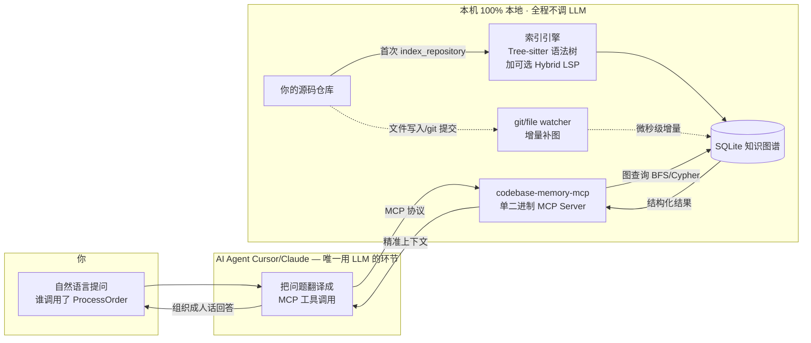

<!--
黄金范例 · 只学房屋风格,按目标仓官方资料重写内容。
学:节序、六件套、callout、语气、中文化、校验脚注、徽章。
不要照抄工具名 / 命令 / 数字(它们是 codebase-memory-mcp 专属)。
-->

# Codebase Memory MCP 使用示例：单二进制本地知识图谱让代理结构查询省 99% Token

> 以「在 Cursor 里接手一个多语言 monorepo：先 10 秒看清架构与路由，再查 `ProcessOrder` 调用链、用 Cypher 筛死代码，合入前看未提交 diff 的 blast radius」为案例，说明 [DeusData/codebase-memory-mcp](https://github.com/DeusData/codebase-memory-mcp) 的核心价值：**Tree-sitter + Hybrid LSP 预索引 → 持久 SQLite 知识图谱 → 14 个 MCP 工具**，让编码代理用 `trace_path` / `get_architecture` / `query_graph` 等直接答结构题，而不是反复 grep/Read——**100% 本地，索引阶段不调用 LLM**。

[](https://github.com/DeusData/codebase-memory-mcp) [](https://github.com/DeusData/codebase-memory-mcp/releases)

## 仓库能力入口一览

> 本仓库以 **单静态二进制 + MCP Server + 可选 CLI** 为主；`install` 还会为 Claude Code 等写入 **Skills 与 PreToolUse Hooks**（增强 Grep/Glob，非阻塞）。**实操见正文案例**。

### 整仓作用与原理

一句话：先在本机把仓库编成知识图谱，再让 Agent 当「查询翻译器」——**建图与查图不调 LLM**，唯一用模型的是宿主把自然语言翻成工具调用。

#### 它是什么

MCP Server + 同一二进制上的可选 CLI / 3D UI。安装物是单个可执行文件，无 Node / Docker / API Key。

#### 解决哪几类问题

| # | 翻车模式 | fix | 代表工具 |
|:-:|---|---|---|
| 1 | 接手仓库靠多轮 Glob/Read | 一次架构摘要 | `get_architecture` |
| 2 | 改函数前漏掉跨文件调用 | 图上查 inbound | `trace_path` |
| 3 | 重构前凭感觉找死代码 | 只读 Cypher | `query_graph` |
| 4 | 合入前估不准影响面 | diff → 符号与风险 | `detect_changes` |

#### 运行机制

> 一图看懂边界：**唯一可能联网/用 LLM 的，是你自己的 Cursor/Claude Agent**；建图与查图全程在本机。


```mermaid
flowchart LR
    subgraph YOU["你"]
        U["自然语言提问<br/>谁调用了 ProcessOrder"]
    end

    subgraph AGENT["AI Agent Cursor/Claude — 唯一用 LLM 的环节"]
        A["把问题翻译成<br/>MCP 工具调用"]
    end

    subgraph LOCAL["本机 100% 本地 · 全程不调 LLM"]
        direction TB
        M["codebase-memory-mcp<br/>单二进制 MCP Server"]
        IDX["索引引擎<br/>Tree-sitter 语法树<br/>加可选 Hybrid LSP"]
        DB[("SQLite 知识图谱")]
        SRC["你的源码仓库"]
        W["git/file watcher<br/>增量补图"]
    end

    U --> A
    A -- "MCP 协议" --> M
    M -- "图查询 BFS/Cypher" --> DB
    DB -- "结构化结果" --> M
    M -- "精准上下文" --> A
    A -- "组织成人话回答" --> U

    SRC -- "首次 index_repository" --> IDX --> DB
    SRC -. "文件写入/git 提交" .-> W -. "微秒级增量" .-> DB
```

> [!note] LSP 依赖（开发者最关心的成本）
> - **要不要自己装 gopls/pyright？** 不用。没有 LSP 时靠 Tree-sitter 也能出调用图。
> - **装了 LSP 会怎样？** 自动走 Hybrid，类型/跨文件边更准——锦上添花，不是前置。
> - **配置成本** ≈ 0：自行探测本机已有语言服务。

#### 典型工程链路

`install.ps1` → 彻底重启 Cursor → 打开真实项目并索引 → 问一道架构题 → `list_projects` 验收。呼应下文「0.2 要不要一上来全量使用?」。

#### 与邻工具边界

| 维度 | codebase-memory-mcp | CodeGraph | Understand Anything |
|---|---|---|---|
| 索引是否用 LLM | **否** | **否** | **是** |
| 语言 | 官方宣称覆盖面更大 + Hybrid LSP | 20+ | Tree-sitter + LLM 摘要 |
| MCP 工具 | Cypher / ADR / 语义 / 架构 | explore / impact / affected | 斜杠 `/understand*` 为主 |
| 索引落点 | 中央 cache + 可选仓内 artifact | 每仓 `.codegraph/` | `.understand-anything/` |
| 与人冲突 | 与 CG：**MCP 二选一** | 与 CBM：**MCP 二选一** | 与二者 **可叠加** |

定量活跃度见文首徽章；正文只写定性。完整对照若另有姊妹文，本文不外链，保持独立。切换前对旧工具执行 `codegraph uninstall` 或 `codebase-memory-mcp uninstall`。见下文「与 CodeGraph、Understand-Anything 怎么选、怎么叠」。

### 二进制、MCP 与 CLI 是什么关系？

**常见误解**：要分别装「索引器」「MCP 包」「可视化」三套东西。

**实际情况**：`codebase-memory-mcp` 是**一个可执行文件**。MCP 模式、CLI 子命令、可选 3D UI（`--ui` 变体）都来自同一安装物；图谱存在 `~/.cache/codebase-memory-mcp/`（可用 `CBM_CACHE_DIR` 覆盖）。

| 入口 | 谁在用 | 典型操作 |
|---|---|---|
| **MCP（Agent）** | Cursor / Claude Code 等 | `index_repository`、`trace_path`、`get_architecture`、`query_graph` |
| **CLI（你）** | 终端 | `codebase-memory-mcp cli trace_path '{"function_name":"main"}'` |
| **3D UI（可选）** | 浏览器 | `codebase-memory-mcp --ui=true --port=9749` → `http://localhost:9749` |
| **install 脚本** | 首次 | 写 MCP 配置 + Skills + Hooks，并下载/放置二进制 |

**推荐首日链**（Windows + Cursor）：

```text
1) 下载并运行 install.ps1（全局一次）
2) 完全重启 Cursor
3) 打开目标项目，对 Agent 说「Index this project」
4) 验收：Settings → MCP 可见 codebase-memory-mcp；list_projects 有节点统计
```

### 索引维度

| 维度 | 说明 |
|---|---|
| **名称** | MCP 工具名 / CLI `cli <tool>` / `install` / `config` |
| **类型** | 单二进制 · MCP Server · CLI · 可选 HTTP 3D UI |
| **职能** | 理解 · 检索 · 影响分析 · 架构 · ADR · 安全边界 |
| **触发** | Agent 调 MCP · 自然语言「Index this project」· `auto_index` 首次连接 |
| **首日** | ✅ `install.ps1` + 重启 Agent + `index_repository` |

### MCP 工具清单

> [!tip] 别背！这些工具其实是「一类事」——代码理解（物理雷达）
> **用大白话说出意图，Agent 会自己挑工具**。心智压缩：
>
> | 你想干什么（说人话） | Agent 会自动调 | 记忆口诀 |
> |---|---|---|
> | 「**建索引** / Index this project」 | `index_repository` | 第一步：建地图 |
> | 「这项目**架构**/语言/路由长啥样」 | `get_architecture` | 看全局 |
> | 「**谁调用了** X / X 调了谁」 | `trace_path` | 查依赖/调用链 |
> | 「帮我**找** XXX 函数/概念」 | `search_graph` / `semantic_query` | 找东西 |
> | 「我**改的代码**影响了啥」 | `detect_changes` | 看影响面 |
>
> 其余（`query_graph`、`manage_adr`、`get_code_snippet`、`list_projects`、`index_status`…）用到再查下表。工具数量以宿主 MCP 面板与 `list_projects` **实测为准**（定量见文首 release 徽章对应的当前文档）。

| 工具 | 职能 | 首日 | 说明 |
|---|---|:---:|---|
| `index_repository` | 理解 | ✅ | 索引仓库；之后 background watcher 增量更新 |
| `list_projects` | 工具 | ✅ | 已索引项目与节点/边计数 |
| `index_status` | 工具 | — | 某项目索引进度 |
| `delete_project` | 工具 | — | 删除项目图谱数据 |
| `get_graph_schema` | 理解 | ✅ | **先跑**：节点/边类型与属性定义 |
| `search_graph` | 检索 | ✅ | 按 label、名称 regex、文件模式、度过滤 |
| `search_code` | 检索 | — | 仅在已索引文件内 grep 式搜索 |
| `semantic_query` | 检索 | — | 本地嵌入向量 + 多信号打分语义搜索 |
| `trace_path` | 理解 | ✅ | BFS：谁调用/被谁调用（depth 1–5） |
| `query_graph` | 理解 | — | openCypher **只读**子集 |
| `get_architecture` | 理解 | ✅ | 语言、包、入口、路由、热点、集群、ADR 一览 |
| `detect_changes` | 理解 | — | git diff → 受影响符号 + 风险分类 |
| `get_code_snippet` | 理解 | — | 按 qualified name 读源码 |
| `manage_adr` | 文档 | — | 架构决策记录 CRUD |
| `ingest_traces` | 理解 | — | 运行时 trace 校验 HTTP 边（进阶） |

### CLI 主命令（节选）

| 命令 | 职能 | 首日 | 说明 |
|---|---|:---:|---|
| `codebase-memory-mcp install` | 工具 | ✅ | 检测 Agent 并写 MCP/Skills/Hooks |
| `codebase-memory-mcp uninstall` | 工具 | — | 清 Agent 配置，**不删**二进制与 DB |
| `codebase-memory-mcp update` | 工具 | — | 检查并更新二进制 |
| `codebase-memory-mcp config set auto_index true` | 工具 | — | 新会话首次连接自动索引 |
| `codebase-memory-mcp cli <tool> '{json}'` | 理解 | — | 任意 MCP 工具 CLI 调用 |
| `codebase-memory-mcp --ui=true` | 工具 | — | 需 **ui** 变体安装包 |

**支持宿主（install 自动检测）**：Claude Code · Cursor · Codex CLI · Gemini CLI · Zed · OpenCode · Antigravity · Aider · KiloCode · VS Code · OpenClaw · Kiro。

---

## 0. 案例背景

你在 Cursor 里维护一个约 **1200 文件** 的后端 monorepo：Go 网关 + Python 业务服务 + 部分 TypeScript 管理脚本。今天要：

1. **10 秒内**知道语言分布、包结构、REST 路由入口——以前 Agent 会多轮 `Glob` + `Read`。
2. 改 `ProcessOrder` 前查清 **inbound 调用链**。
3. 重构前用 **Cypher** 找零 caller 的函数候选。
4. 合入前看 **未提交 diff** 波及的符号与风险。

[codebase-memory-mcp](https://github.com/DeusData/codebase-memory-mcp) 的定位是：**先建本地知识图谱，再让 MCP 客户端 Agent 当「查询翻译器」**——服务端**不含 LLM**，避免再配一套 NL→图查询模型。官方论文（[arXiv:2603.27277](https://arxiv.org/abs/2603.27277)）在真实仓库上报告更高答案质量、更少 token 与更少 tool calls（相对逐文件探索；定量以论文页为准）。

本文在 **Windows 11 + Cursor** 环境示范；Claude Code / Codex 等价路径见案例 A 备选。

## 0.1 这个仓库到底是什么？

详见文首 [整仓作用与原理](#整仓作用与原理)。分层速查：

| 层 | 内容 |
|---|---|
| **安装层** | `install.ps1`（或 curl 一行脚本）；单静态二进制，**无 Node/Docker/API Key** |
| **接 Agent** | `install` 写 `.cursor/mcp.json` 等；Claude Code 额外装 Skills + PreToolUse |
| **符号解析** | 内置 Tree-sitter；本机若有 `gopls`/`pyright` 等则 Hybrid 精化 |
| **索引** | `index_repository(repo_path=绝对路径)`；数据在 `~/.cache/codebase-memory-mcp/` |
| **运行时** | git/file watcher 增量；`config set auto_index true` 可首次连接自动索引 |

## 0.2 要不要一上来全量使用？

**建议首日链**：`install.ps1` → 重启 Cursor → 一个真实项目 **Index** → 问一道架构题 → `list_projects` 验收。

**适合**：

- 代理探索阶段 tool calls / token 偏高。
- **多语言 monorepo** 或需要 **Cypher / ADR / 死代码 / 3D 图谱**。
- 涉密仓：**索引不出本机、不调 LLM**。
- Windows 想要 **单 exe、零运行时依赖**。

**不适合**：

- 要 **LLM 业务语义、Guided Tour、业务域 flows** → 用 Understand-Anything。
- 已深度绑定 **CodeGraph `affected` CI** 且不需要 CBM 高级特性 → 可继续用 CG。
- **已与 CodeGraph 同时接 MCP** → 先 uninstall 其一。

## 0.3 功能覆盖索引

| 功能 / 能力 | 本文位置 | 第一天需要吗 | 主要风险 |
|---|---|---:|---|
| Windows `install.ps1` | 案例 A | 是 | SmartScreen 警告；用 checksums 校验 |
| 重启 Cursor + MCP 工具可见 | 案例 A | 是 | 未重启则 MCP 不可见 |
| `index_repository` / 「Index this project」 | 案例 B | 是 | 须传**绝对路径** |
| `get_architecture` | 案例 C | 是 | 大仓首次索引 CPU 占用 |
| `trace_path` | 案例 D | 是 | 符号名需先 `search_graph` 消歧 |
| `query_graph` Cypher | 案例 E | 建议 | 只支持只读 openCypher 子集 |
| `detect_changes` | 案例 F | 可选 | 仅未提交/已索引符号 |
| 3D UI | 案例 G | 可选 | 需 `--ui` 变体 |
| A/B 看效果实验 | 如何看效果 | 建议 | 对比工具调用次数与完整度 |
| 与 CG/UA 选型 | 与同类怎么选 | 建议 | **勿双开 CG+CBM MCP** |

---

## 案例 A · Windows 安装并接到 Cursor

> **场景**：你想把这个「项目记忆」插件装进 Cursor，让 AI 之后能查图谱。一次性配置，全局生效。

**角色**：Windows 11，已装 Cursor，可访问 GitHub raw。

**怎么用**：

```powershell
Invoke-WebRequest -Uri https://raw.githubusercontent.com/DeusData/codebase-memory-mcp/main/install.ps1 -OutFile install.ps1
.\install.ps1
```

**你会看到什么(示例输出)**：

```text
# 示意
安装脚本下载二进制并写入 Cursor MCP 配置。
彻底重启后，Settings → MCP 列表出现 codebase-memory-mcp，
并能看到一组 tools（数量以面板实测为准）。
终端: codebase-memory-mcp --version 能打印版本。
```

**效果(用了 vs 没用)**：共性收益见 [关键收益总结](#关键收益总结用了-vs-没用)。

| | 不用安装脚本 | 用 install.ps1 |
|---|---|---|
| 配置 | 手写 mcp.json、自己找二进制路径 | 脚本一次写入宿主 |
| 回滚 | 自己删配置 | `codebase-memory-mcp uninstall` |

**实操卡**

```text
前置条件: 允许运行 install.ps1（会写 Cursor MCP 配置）；愿意审阅脚本内容。
可执行步骤:
  1) PowerShell:
     Invoke-WebRequest -Uri https://raw.githubusercontent.com/DeusData/codebase-memory-mcp/main/install.ps1 -OutFile install.ps1
  2) （推荐）notepad install.ps1 快速浏览
  3) .\install.ps1
     可选 3D UI: .\install.ps1 --ui
     仅二进制不写配置: .\install.ps1 --skip-config
  4) 完全退出并重启 Cursor
  5) Cursor Settings → MCP，确认 codebase-memory-mcp 可见
验收方式:
  - 终端: codebase-memory-mcp --version 或 where 能找到二进制
  - Cursor MCP 列表可见该 server
失败处理:
  - SmartScreen → 「更多信息」→「仍要运行」；对照 release checksums.txt 校验 SHA-256
  - MCP 未出现 → 查 .cursor/mcp.json 路径是否为绝对路径；重跑 install
  - 二进制不在 PATH → 按 install 输出把 ~/.local/bin 等加入用户 PATH
风险边界: install 会改 Agent MCP/Skills/Hooks；回滚用 codebase-memory-mcp uninstall。中风险，可逆。
```

**macOS / Linux 一行装**：

```bash
curl -fsSL https://raw.githubusercontent.com/DeusData/codebase-memory-mcp/main/install.sh | bash
# 带 UI:
curl -fsSL https://raw.githubusercontent.com/DeusData/codebase-memory-mcp/main/install.sh | bash -s -- --ui
```

**Claude Code 备选**：对 Agent 说「Install this MCP server: https://github.com/DeusData/codebase-memory-mcp」，或手动在 `~/.claude/.mcp.json` 写入绝对路径 command。

**手动 MCP 配置**（不用 install 时）：

```json
{
  "mcpServers": {
    "codebase-memory-mcp": {
      "command": "C:/Users/you/.local/bin/codebase-memory-mcp",
      "args": []
    }
  }
}
```

版本号见文末校验脚注与文首 release 徽章，此处不硬写 tag。

---

## 案例 B · 索引项目：index_repository

> **场景**：你刚 clone 下来一个 1200 文件的后端仓库，准备让 AI 帮你干活。第一件事不是直接提问，而是先让它「把整个项目读一遍、画好地图」——这一步就叫**索引**，只需做一次，之后会自动增量更新。

**角色**：已在目标仓库根目录打开 Cursor。

**怎么用**：在 Agent 对话框里说一句话即可：

```text
Index this project
（或通用中文：请用 Codebase Memory MCP 索引本项目，路径用本项目的绝对路径）
（或更明确：请用 index_repository，repo_path 用本项目的绝对路径）
```

**你会看到什么(示例输出)**：AI 调用工具后返回一份「建图回执」，关键是 **nodes / edges 不为 0**：

```text
# 示意
✓ Indexed: my-backend
  Files:     1,204
  Nodes:     18,432   (Function/Method/Class/File/Route ...)
  Edges:     42,109   (CALLS/IMPORTS/DEFINES ...)
  Languages: Go 62% · Python 30% · TypeScript 8%
  Elapsed:   23.4s
```

> Nodes（节点）= 它认出的函数/类/文件等「东西」；Edges（边）= 它们之间的关系（谁调用谁、谁导入谁）。这就是那张「地图」。

**效果(用了 vs 没用)**：共性收益见 [关键收益总结](#关键收益总结用了-vs-没用)。

- 这一步**一次性付出几十秒 CPU**，换来后续结构问题「查地图」。
- 之后改代码，靠 git/文件 watcher **自动增量更新**。

> [!note] Watcher 到底常不常驻、吃不吃资源？
> Watcher **随 MCP 宿主启动而激活、随其退出而结束**，不是独立守护进程。平时静默，仅在文件写入或 git 提交时做增量补图。

> [!question] 我改了 / 新增了 / 删了代码，要重新索引吗？
> **绝大多数情况不用。** 日常小改交给 watcher；大变动（`git pull`、切大分支）或结果可疑时，再说「Reindex this project」。

**实操卡**

```text
前置条件: 案例 A 完成；当前目录为项目根。
可执行步骤:
  1) 在 Agent 输入:
     「Index this project」
     或通用中文: 请用 Codebase Memory MCP 索引本项目，路径用本项目的绝对路径
     或更明确: 请用 index_repository，repo_path 用本项目的绝对路径
  2) CLI 验收（可选）:
     codebase-memory-mcp cli list_projects
  3) 查看状态:
     codebase-memory-mcp cli index_status '{"repo_path": "D:/path/to/repo"}'
验收方式:
  - list_projects 显示该项目，nodes/edges > 0
  - 中型仓通常在秒级～数十秒完成（视文件数而定）
失败处理:
  - index_repository fails → repo_path 必须是绝对路径
  - 超大仓 → config set auto_index_limit 50000 或 .cbmignore 排除目录
  - 想自动索引: codebase-memory-mcp config set auto_index true
风险边界: 首次索引 CPU/内存占用；尊重 .gitignore + .cbmignore；符号链接始终跳过。
```

**团队 artifact（可选，大仓强烈推荐）**

- 推荐在 **CI 或主干**上跑一次全量 index，生成 `.codebase-memory/graph.db.zst` 并**提交进仓库**。
- 队友首次拉代码后先导入现成图谱再增量，避免每人重复全量索引。
- 不想入库：把 `.codebase-memory/` 加入 `.gitignore`。

---

## 案例 C · 架构一览：get_architecture

> **场景**：陌生项目刚接手，你脑子里一片空白——它用什么语言写的？有哪几个核心模块？请求从哪进来？这本来要你点开十几个文件慢慢摸，现在一句话让 AI 直接给你一张「项目全景图」。

**角色**：刚接手项目，要先建立心智模型。

**怎么用**：

```text
用 get_architecture 给出本项目的语言、包、入口点、REST 路由和热点模块摘要。
不要先 grep 全仓。
```

**你会看到什么(示例输出)**：

```text
# 示意
Languages:   Go 62% · Python 30% · TypeScript 8%
Entry points: cmd/gateway/main.go · services/order/app.py
Packages:    gateway, order, payment, auth, common (5)
REST Routes:
  POST /orders        → order.handlers.CreateOrder
  GET  /orders/{id}   → order.handlers.GetOrder
  POST /payments      → payment.handlers.Charge
Hotspots: order.service.ProcessOrder
ADR: 若干条架构决策记录
```

**效果(用了 vs 没用)**：共性收益见 [关键收益总结](#关键收益总结用了-vs-没用)。

| | 不用本工具 | 用 get_architecture |
|---|---|---|
| AI 的动作 | 多轮 `Glob` + `Read` | **1 次工具调用**给结构 |
| 你的体感 | 等很久、答得零散 | 先有地图再深入 |

> **怎么确认它是「查地图」而非「翻书」**：对话里应出现 `get_architecture`；若在疯狂 `Read`，多半没索引或没重启。

**实操卡**

```text
前置条件: 案例 B 索引完成。
可执行步骤:
  1) Agent 提示（示例）:
     「用 get_architecture 给出本项目的语言、包、入口点、REST 路由和热点模块摘要。
      不要先 grep 全仓。」
  2) 对照返回的路由与包名，在 IDE 打开 1–2 个入口文件验证
  3) 可选 CLI:
     codebase-memory-mcp cli get_architecture '{"repo_path": "D:/path/to/repo"}'
验收方式: 回答含 languages、packages、routes 等结构化字段，与仓库实际大致一致。
失败处理: 结果混入别的项目 → 加 project= 参数；先用 list_projects 看项目名
风险边界: 路由↔handler 为 heuristic+置信度；合入前仍以源码为准。
```

---

## 案例 D · 调用链：trace_path

> **场景**：你要改 `ProcessOrder` 这个函数，但心里没底——「改了它会不会连累别的地方爆掉？」。你需要先知道**谁在调用它**（inbound 调用链）。手动找等于全仓搜函数名再一个个看，容易漏掉跨文件、跨包的调用。

**角色**：准备修改 `ProcessOrder`。

**怎么用**（把 `ProcessOrder` 换成你的真实函数名）：

```text
用 trace_path 查 ProcessOrder 的 inbound 调用链，depth=3。
```

**你会看到什么(示例输出)**：一棵「谁调用了它」的树，跨文件/跨包也连得上：

```text
# 示意
ProcessOrder  (order/service.go:88)
├── CreateOrder        order/handlers.go:42      [深度1]
│   └── router.POST    cmd/gateway/main.go:120   [深度2]
├── RetryOrderJob      jobs/retry.go:31          [深度1]
└── BatchImport        scripts/import.py:77      [深度2, 跨语言]
→ 若干 caller，跨多个包
```

**效果(用了 vs 没用)**：共性收益见 [关键收益总结](#关键收益总结用了-vs-没用)。

- **全**：跨语言、跨目录的调用也更容易抓到——纯文本 `grep` 很容易漏。
- **能直接用**：把 caller 列表抄进 PR 测试计划。

**实操卡**

```text
前置条件: 索引含目标符号。
可执行步骤:
  1) 若名称不确定，先:
     search_graph name_pattern=".*ProcessOrder.*" label=Function
  2) Agent:
     「用 trace_path 查 ProcessOrder 的 inbound 调用链，depth=3。」
  3) 将 callers 列表写入 PR 测试计划
验收方式: 返回含跨文件/跨包边（Hybrid LSP 语言上更准）。
失败处理: 0 results → search_graph 找精确符号名；确认已 index 该文件
风险边界: 动态 dispatch / 反射边可能不完整；impact 决策仍要 code review。
```

**工具选用速查**

| 意图 | 工具 |
|---|---|
| 谁调用 X / X 调用谁 | `trace_path` |
| 按名/类型搜符号 | `search_graph` |
| 自然语言找概念 | `semantic_query` |
| 未提交改动影响 | `detect_changes` |
| 复杂图模式 | `query_graph` |

---

## 案例 E · Cypher：query_graph 查死代码

> **场景**：项目里堆了不少「写了但好像没人用」的函数（死代码 / dead code），重构前想清理掉。「没有任何人调用的函数」正好是一个**图查询**问题。
>
> **Cypher 是什么**：一种专门「在关系图里提问」的查询语言。本工具支持它的**只读子集**，可以让 AI 代写。

**角色**：重构前清理无用函数。

**怎么用**：先看懂图里有哪些节点和边，再查没有 caller 的函数。实用版（推荐，带路径过滤）：

```cypher
// 示意：排除测试与第三方，只在业务目录里找「看起来没人调用」的函数
MATCH (f:Function)
WHERE NOT f.file_path CONTAINS "test"
  AND NOT f.file_path CONTAINS "vendor"
  AND NOT f.file_path CONTAINS "node_modules"
  AND NOT EXISTS { (f)<-[:CALLS]-() }
RETURN f.name, f.file_path
LIMIT 20
```

**你会看到什么(示例输出)**：带文件路径的候选名单：

```text
# 示意
f.name                f.file_path
------------------------------------------------------
legacyExport          services/order/export_v1.go
debugCharge           services/payment/debug.go
formatV1              common/util/format.go
```

**效果(用了 vs 没用)**：共性收益见 [关键收益总结](#关键收益总结用了-vs-没用)。

- 从「全仓翻找」变成「带路径过滤的候选」；**这是候选不是判决**。删除前务必人工确认。

**实操卡**

```text
前置条件: 理解 get_graph_schema 中的节点/边类型与属性（确认有 file_path 字段）。
可执行步骤:
  1) 先 get_graph_schema 了解 Function / CALLS / file_path 等
  2) Agent 或 CLI 跑带 test/vendor 路径过滤的查询
  3) 对返回结果再人工排除 main、handler、导出 API 等入口点
验收方式: 返回候选函数列表（含 file_path）；spot check 2–3 个确无 caller。
失败处理: unsupported 错误 → 查 README openCypher 子集；不支持 MERGE/WRITE
风险边界: 入口点检测 heuristic；勿批量删除未人工确认的符号。
```

---

## 案例 F · 合入前：detect_changes

> **场景**：你在 feature 分支改了几个文件，准备提交合并。合并前最怕「我以为只改了 A，结果连累了 B、C」。这一步基于**还没提交的改动（git diff）**算出受波及的符号和风险等级。

**角色**：feature 分支改了几处 service，合入前要看 blast radius。

**怎么用**：

```text
用 detect_changes 分析我当前未提交改动影响了哪些符号，以及各自的风险等级。
```

**你会看到什么(示例输出)**：

```text
# 示意
Changed files: 3
影响符号:
  order/service.go  ProcessOrder      [HIGH]
  order/handlers.go CreateOrder       [MED]
  util/format.go    formatV2          [LOW]
建议补测: order 路由全链路、payment 回调
```

**效果(用了 vs 没用)**：共性收益见 [关键收益总结](#关键收益总结用了-vs-没用)。

- 把 HIGH 风险符号落到 code review 与 PR 测试计划。
- 基于静态图 + diff，**不替代集成测试**。

**实操卡**

```text
前置条件: 工作区有 git diff；文件已在索引中。
可执行步骤:
  1) Agent:
     「用 detect_changes 分析当前未提交改动影响的符号与风险等级。」
  2) 对照输出列出需补测的模块
验收方式: 输出映射到具体 Function/Method 与 risk classification。
失败处理: 空结果 → 改动文件未 index 或不在 git diff；先 index_repository 再改
风险边界: 基于静态图 + git diff，不替代集成测试。
```

---

## 案例 G · 3D 图谱 UI（可选）

> **场景**：前面几招都是 AI 用文字回答。有时你想**亲眼看看**哪些模块是中心枢纽、哪些是孤岛。

**角色**：想肉眼浏览图谱，而不只靠 Agent 文本。

**怎么用**：

```text
codebase-memory-mcp --ui=true --port=9749
```

然后浏览器打开 `http://localhost:9749`。

**你会看到什么(示例输出)**：

```text
# 示意
本机浏览器里一张可旋转的 3D 力导向图。
点 = 函数/文件，线 = 调用关系；被依赖多的节点更居中。
适合探索和讲解，改码仍回到 Agent 对话。
```

**效果(用了 vs 没用)**：共性收益见 [关键收益总结](#关键收益总结用了-vs-没用)。

| | 只用文字工具 | 加上 3D UI |
|---|---|---|
| 讲解 | 只能念调用链 | 可指着枢纽节点讲模块 |

**实操卡**

```text
前置条件: 安装时用了 --ui 变体，或下载 codebase-memory-mcp-ui-* 包。
可执行步骤:
  1) codebase-memory-mcp --ui=true --port=9749
  2) 浏览器打开 http://localhost:9749
  3) 与 Agent 会话并行：UI 作探索，Agent 作改码
验收方式: 3D 力导向图可缩放、筛选节点。
失败处理: 404/空白 → 确认 ui 变体；检查端口占用
风险边界: UI 仅本机；勿把含源码路径的截图发外网。
```

---

## 关键收益总结(用了 vs 没用)

| 环节 | 不用本工具 | 用了之后 | 怎么自检 |
|---|---|---|---|
| 接手仓库 | 多轮翻文件拼架构 | 一次 `get_architecture` | 对话里出现该工具而非疯狂 Read |
| 改敏感函数 | grep 漏跨语言调用 | `trace_path` 给出 inbound | caller 能对到源码 |
| 合入前 | 凭感觉估影响面 | `detect_changes` 标风险 | HIGH 项写进 PR 测试计划 |
| 成本 | 每次探索都耗 token | 查本地图谱 | A/B 对比工具调用次数 |

各案例「效果」只保留特有行，共性看本表。

## 如何看效果

> 装完怎么确认它真的帮你省了？官方论文见参考链接。下面用 2 分钟 A/B 亲眼看差距。

```text
A 组（不走图谱）: 新开对话，先说「这次不要用任何 MCP 图谱工具，直接读文件回答」，
                 再问：「ProcessOrder 被哪些地方调用？」
B 组（走图谱）:   再开对话，直接问：「用 trace_path 查 ProcessOrder 的调用链。」
```

| 看什么 | 在哪看 | A 组（翻书） | B 组（查图谱） |
|---|---|---|---|
| **工具调用次数** | 对话里展开的工具步骤 | 多次 `Read`/`Grep` | 通常 **1 次** `trace_path` |
| **响应速度** | 体感 | 一轮轮翻 | 近乎秒回 |
| **答案完整度** | 对照源码 | 易漏跨文件调用 | 跨文件/跨包更全 |

判断有没有走对路：**回答时调用的是图谱工具，而不是反复 `Read` / `Grep`**。

## 与 CodeGraph、Understand-Anything 怎么选、怎么叠

```text
MCP 物理雷达（二选一）:
  · 选 codebase-memory-mcp: 多语言、Cypher、ADR、死代码、语义搜索、3D UI、单二进制
  · 选 CodeGraph: 心智更简单、explore 一问一答、affected 测试文件 CI 故事成熟
  · 禁止: 两个 MCP 同时接同一 Agent

可与 UA 叠加:
  · 周末 /understand 做业务语义 + Dashboard + Tour
  · 工作日 CBM 或 CG 之一做结构查询

从 CodeGraph 迁移到 CBM:
  1) codegraph uninstall --target=cursor --yes
  2) .\install.ps1
  3) 重启 Cursor → Index this project
  4) .codegraph/ 可保留作备份，但 Agent 只应调 CBM MCP
```

---

## 常见坑

| 坑 | 原因 | 规避 |
|---|---|---|
| MCP 不可见 | 未重启 Agent | 完全退出 Cursor/Claude 再开 |
| index 失败 | 相对路径 | `repo_path` 必须绝对路径 |
| trace_path 0 结果 | 符号名不匹配 | 先 `search_graph` |
| 与 CodeGraph 混用 | 两个图谱 MCP | uninstall 其一 |
| SmartScreen 拦截 | 未签名 exe | checksums + 仍要运行 |
| 查询错项目 | 多项目共 cache | `list_projects` + `project=` 参数 |
| Cypher 报错 unsupported | 超出只读子集 | 读 README Supported Cypher |
| 索引过慢 | 极大 monorepo | `.cbmignore`、auto_index_limit |
| 结果含旧符号/漏新模块 | 宿主没开时有外部改动 | 手动 reindex 一次 |

---

## 实操检查清单

- [ ] `install.ps1` 跑通且（可选）审阅过脚本
- [ ] Cursor MCP 可见该 server 且已重启
- [ ] 目标仓 `list_projects` 有节点/边统计
- [ ] Agent 问架构题时出现 `get_architecture` 或 `trace_path`
- [ ] 做过一次 A/B 对比
- [ ] 改敏感符号前跑过 `trace_path` 或 `detect_changes`
- [ ] 知晓 **CodeGraph 与 CBM MCP 勿双开**
- [ ] 知晓 `codebase-memory-mcp uninstall` 回滚方式
- [ ] （可选）3D UI 可打开

---

## 底层逻辑

1. **它不是大模型，而是本地的「图数据库翻译官」**。你问宿主 → 宿主（唯一用 LLM 的环节）把自然语言翻成工具调用 → 它用图查询定位结构。省 token 的本质是「查地图」替代「翻一遍书」。
2. **MCP 工具互斥：CodeGraph 与 codebase-memory-mcp 不可同开**。同时接会让 Agent 陷入工具选择混乱。与 Understand-Anything 可叠加。
3. **绝对路径铁律**。`index_repository` 必须传磁盘绝对路径。相对路径 `.` 会直接导致建图失败。

---

## 参考链接

- 官方仓库：[DeusData/codebase-memory-mcp](https://github.com/DeusData/codebase-memory-mcp)
- 文档站：[deusdata.github.io/codebase-memory-mcp](https://deusdata.github.io/codebase-memory-mcp/)
- 论文：[arXiv:2603.27277](https://arxiv.org/abs/2603.27277)

| **本文校验** | 2026-09-18，对照 [main README](https://github.com/DeusData/codebase-memory-mcp/blob/main/README.md)（安装脚本、MCP 工具清单、Hybrid LSP、三工具生态位；版本见文首 release 徽章） |
